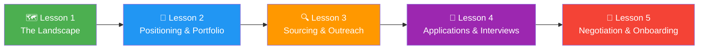

# Lesson 001: The Remote ML Job Landscape in 2026: Your Roadmap

> **Job search** &nbsp;|&nbsp; Lesson 1 of 5 &nbsp;|&nbsp; August 1, 2026
> *Generated by [Wren Learning](https://github.com/vmercel/wren-learning) • beginner • conceptual style*

---

## Overview

The remote machine learning job market in 2026 is booming — but it's also noisier, more competitive, and more global than ever. This opening lesson maps the entire terrain so you can navigate it strategically instead of sending 500 résumés into the void. By the end of this 5-lesson series, you'll have a repeatable system to land a remote ML role.

## 💡 Why This Matters Right Now

Here's a number that should get your attention: **over 60% of machine learning roles posted in early 2026 offer a remote or hybrid option**, up from roughly 30% in 2022. The explosion of AI products — from generative AI applications to ML-powered operations tools — has created enormous demand for ML talent.

But here's the catch:

> **More remote openings also means more global competition.** A single remote ML engineer posting can attract 500+ applicants from 40+ countries.

So the question isn't *"Are there jobs?"* — there are plenty. The question is: **"How do I stand out, get noticed, and convert opportunities into offers?"**

That's exactly what this 5-lesson series will teach you.

## 💡 What Is a 'Remote ML Job' Anyway?

Let's define every term clearly so we're on the same page:

- **Remote job**: A position where you work from a location of your choosing (home, co-working space, café) rather than commuting to a company office. Communication happens via video calls, chat tools (Slack, Teams), and shared documents.

- **Machine Learning (ML)**: A branch of artificial intelligence where computers learn patterns from data instead of being explicitly programmed. For example, an ML model can learn to detect spam emails by studying millions of examples of spam and non-spam.

- **ML job roles** span a wide spectrum:

| Role | What You Do |
|------|-------------|
| **ML Engineer** | Build, deploy, and maintain ML models in production systems |
| **Data Scientist** | Analyze data, build models, and communicate insights |
| **MLOps Engineer** | Manage the infrastructure and pipelines that serve ML models |
| **Research Scientist** | Push the boundaries of what ML can do (new architectures, papers) |
| **Applied Scientist** | Solve specific business problems using ML techniques |
| **AI Product Manager** | Guide the strategy and development of AI-powered products |

All of these roles can be — and increasingly are — performed remotely.

## 🌟 The Fishing Analogy: Your Job Search Strategy

Think of your remote ML job search as **deep-sea fishing**, not casting a net from shore.

🎣 **Amateur approach (casting from shore):** You stand on the beach (a job board), throw a wide net (generic résumé) into the ocean, and hope something swims in. You're competing with hundreds of other people doing the exact same thing from the exact same beach.

🚤 **Strategic approach (deep-sea fishing):** You study where the fish actually swim (which companies are hiring, what skills they need). You choose the right bait (a tailored portfolio and résumé). You go to deeper waters where fewer boats are fishing (warm introductions, niche communities, direct outreach). And you use a fish finder (tracking tools, analytics on your applications).

> **This entire 5-lesson series is about turning you from a shore caster into a deep-sea fisher.**

## 💡 The 5-Stage System: Your Series Roadmap

Over the next five lessons, we'll build a complete job-search system. Here's the map:

1. **📍 Lesson 1 (Today): The Landscape** — Understand the market, the roles, and the mindset shift required
2. **🎯 Lesson 2: Positioning & Portfolio** — Craft your professional identity so the *right* jobs find *you*
3. **🔍 Lesson 3: Sourcing & Outreach** — Where to find hidden remote ML jobs and how to get warm introductions
4. **📝 Lesson 4: Applications & Interviews** — Tailor every application; ace ML-specific technical and behavioral interviews
5. **🤝 Lesson 5: Negotiation & Onboarding** — Negotiate remote-specific terms (timezone, equipment, comp) and start strong

Each lesson builds on the previous one. Skip a step, and the system breaks down — just like skipping ingredients in a recipe.

## 💡 The 2026 Market: Key Trends You Must Know

Before you start applying, you need to understand the forces shaping the market:

**1. The "AI Infrastructure" Boom**
Companies aren't just building ML models anymore — they're building the *platforms, pipelines, and tooling* around models. **MLOps and ML platform roles have grown 3x faster than pure research roles** since 2024.

**2. Regional Pay Arbitrage Is Shrinking**
More companies now use **location-adjusted pay bands**. A remote ML engineer in Lisbon might earn 75-90% of what the same role pays in San Francisco, not 40% like it was years ago. This is good news for global talent.

**3. The Portfolio > The Résumé**
Hiring managers increasingly want to **see your work**, not just read about it. A deployed model, a well-documented GitHub repo, or a technical blog post often outweighs a bullet point on a résumé.

**4. Async-First Culture**
The best remote companies operate **asynchronously** — meaning work doesn't require everyone to be online at the same time. This favors candidates who can communicate clearly in writing (documentation, proposals, pull request reviews).

**5. AI Is Screening Your Application**
Many companies now use **AI-powered applicant tracking systems (ATS)** that score résumés before a human ever sees them. Understanding how these systems work is no longer optional — it's survival.

## ✍️ Exercise: Your Starting Point Audit

Before we move forward, take 10 minutes to honestly assess where you stand. Rate yourself 1-5 on each dimension:

| Dimension | Question to Ask Yourself | Your Score (1-5) |
|-----------|--------------------------|------------------|
| **Technical Skills** | Can I build, train, and deploy an ML model end-to-end? | _____ |
| **Portfolio** | Do I have 2-3 public projects that showcase my ML work? | _____ |
| **Online Presence** | Would a hiring manager find impressive results if they Googled me? | _____ |
| **Network** | Do I know 5+ people working in ML who could refer me? | _____ |
| **Interview Readiness** | Could I whiteboard an ML system design today? | _____ |

> **If you scored below 3 on any dimension, that's not a problem — it's a *priority*.** This series will help you raise every score.

Write your scores down. We'll revisit them in Lesson 5 to measure your progress.

## Diagram

## Key Concepts

| Term | Definition |
|------|------------|
| **Remote Work** | A work arrangement where the employee performs their job from a location outside the company's physical office, communicating via digital tools. |
| **Machine Learning (ML)** | A subset of artificial intelligence where systems automatically learn and improve from data without being explicitly programmed for every scenario. |
| **MLOps** | The practice of deploying, monitoring, and maintaining machine learning models in production — the 'DevOps' of machine learning. |
| **Applicant Tracking System (ATS)** | Software used by employers to collect, sort, scan, and rank job applications — often using AI to filter candidates before a human reviews them. |
| **Asynchronous (Async) Work** | A work style where team members contribute on their own schedules rather than needing to be online simultaneously, relying on written communication. |

## Real-World Analogy

> Your remote ML job search is like deep-sea fishing, not standing on the shore casting a wide net. Amateurs throw generic bait everywhere and hope for luck. Professionals study where the fish swim, choose the right bait for the species they want, go to less crowded waters, and use a fish finder to track results. Every lesson in this series gives you a better boat, better bait, and a more accurate fish finder.

## Today's Takeaways

- [ ] The remote ML job market in 2026 is large but fiercely competitive — strategy beats volume every time.
- [ ] ML roles are diverse (engineer, scientist, MLOps, PM) and nearly all can be done remotely — choose your target before you start applying.
- [ ] Three forces will shape your success: a visible portfolio, strong async communication skills, and understanding how AI-powered screening works.

## Knowledge Check

**According to 2026 market trends, which type of ML role has grown the fastest in recent years?**

- A) MLOps and ML platform engineering roles
- B) Pure ML research scientist roles
- C) AI ethics and policy roles
- D) Data visualization specialist roles

See Answer

**Answer: A) MLOps and ML platform engineering roles**

The lesson highlights that MLOps and ML platform roles have grown 3x faster than pure research roles since 2024, driven by the 'AI Infrastructure Boom' — companies need people to deploy and maintain models at scale, not just build them. While research, ethics, and visualization roles exist, they haven't seen the same explosive growth rate.

---

*Part of the [Job search](https://github.com/vmercel/wren-learning/job-search) learning campaign &nbsp;•&nbsp; [View all lessons](https://github.com/vmercel/wren-learning)*
