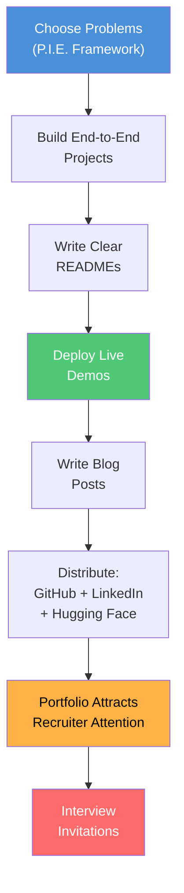

# Lesson 002: Building a Portfolio That Lands Remote ML Interviews

> **Job search** &nbsp;|&nbsp; Lesson 2 of 5 &nbsp;|&nbsp; August 1, 2026
> *Generated by [Wren Learning](https://github.com/vmercel/wren-learning) • beginner • conceptual style*

---

## Overview

Your portfolio is the single most important asset in a remote ML job search — it speaks for you when you're not in the room. This lesson teaches you exactly what to build, how to present it, and which portfolio mistakes silently disqualify candidates before they ever reach a human reviewer.

## 💡 Why Portfolios Matter More Than Résumés in Remote ML

In a traditional office job, you get interviews partly through **personal connections** — a handshake at a meetup, a warm introduction from a colleague. In remote hiring, especially for machine learning roles, recruiters and hiring managers often never meet you in person. Your portfolio becomes your **handshake, your first impression, and your proof of competence** all at once.

> **Key insight:** A 2025 survey by Hired found that 74% of remote ML hiring managers said they evaluate a candidate's GitHub or portfolio **before** reading their résumé.

Here's why:

- **Résumés tell.** Portfolios **show.**
- ML is a *doing* discipline — companies want to see that you can wrangle data, train models, and deploy solutions, not just list buzzwords.
- Remote roles attract **global applicants**. A strong portfolio is how you stand out from hundreds of candidates across time zones.

Think of your portfolio as a **24/7 interview** that runs while you sleep.

## 💡 The Anatomy of a Winning ML Portfolio

A great ML portfolio is **not** a graveyard of Jupyter notebooks. It's a curated, well-organized showcase. Here's what it should contain:

| Component | What It Is | Why It Matters |
|---|---|---|
| **3–5 Featured Projects** | End-to-end ML projects with clear README files | Shows depth, not just breadth |
| **Live Demos or Deployments** | A model served via an API, a Streamlit app, or a Hugging Face Space | Proves you can ship, not just experiment |
| **Clear Documentation** | Each project explains the problem, approach, results, and lessons learned | Shows communication skills — critical for remote work |
| **Technical Blog Posts** | 2–4 articles explaining concepts or walking through your projects | Demonstrates you can teach, think clearly, and write asynchronously |
| **Contribution History** | Open-source contributions or Kaggle competition entries | Shows collaboration and community engagement |

> **Rule of thumb:** Quality over quantity. **Three polished projects beat twenty abandoned notebooks** every time.

## 🌟 The Lighthouse Analogy

Imagine you're a **lighthouse keeper** on a remote island, and ships (hiring managers) are sailing through foggy waters looking for safe harbor.

- Your **lighthouse** is your portfolio.
- The **light beam** is the signal you send — your projects, your writing, your deployed demos.
- The **fog** is the noise of thousands of other applicants.

If your lighthouse is dim (a bare GitHub with forked repos and no READMEs), ships sail right past you. If it's bright and steady (polished projects, clear documentation, live demos), ships navigate toward you *automatically*.

The best part? A lighthouse works **whether you're awake or asleep**. A strong portfolio attracts recruiters and inbound opportunities 24/7, across every time zone — which is exactly the superpower you need for a remote job search.

## 💡 What to Build: Choosing Projects That Get Noticed

Not all projects are created equal. Here's a framework called **P.I.E.** for choosing what to build:

**P — Problem-Oriented**
Start with a *real problem*, not a dataset. Instead of "I trained a CNN on CIFAR-10," try "I built a system that detects defective products on a manufacturing line using computer vision." Hiring managers care about **problems solved**, not algorithms used.

**I — Industry-Relevant**
Align your projects with the industries you're targeting. If you want to work in healthcare ML, build a clinical NLP project. If fintech, build a fraud detection pipeline. This signals **intentionality**.

**E — End-to-End**
Don't stop at model training. Show the full pipeline:

1. **Data collection or acquisition** — Where did the data come from?
2. **Exploration and cleaning** — What did you discover? What was messy?
3. **Modeling** — What approaches did you try? Why?
4. **Evaluation** — What metrics did you use? How did you validate?
5. **Deployment** — Can someone *use* your model right now?
6. **Monitoring (bonus)** — How would you detect model drift?

> Projects that end at a Jupyter notebook say "I'm a student." Projects that include deployment say **"I'm ready to work."**

## 💻 The README: Your Project's Front Door

The **README** file is the first thing anyone sees when they visit your project on GitHub. A great README turns a casual browser into an impressed interviewer. Here's a template:

```markdown
# Project Title
One-sentence description of what this project does and why it matters.

## 🎯 Problem Statement
What real-world problem does this solve?

## 📊 Data
Where the data came from, its size, and any preprocessing steps.

## 🛠️ Approach
Models tried, architecture decisions, and why you chose them.

## 📈 Results
Key metrics, charts, and comparisons. Include a results table.

## 🚀 How to Run
Step-by-step instructions to reproduce your work.

## 🌐 Live Demo
Link to deployed app or API endpoint.

## 💡 Lessons Learned
What surprised you? What would you do differently?
```

**Why this matters for remote work specifically:** Remote teams communicate asynchronously through writing. A well-written README is direct evidence that you can **communicate complex technical work clearly in writing** — arguably the #1 skill remote employers evaluate.

## 💡 Where to Host and How to Be Discoverable

Building great projects is half the battle. The other half is making sure **people can find them**. Here's your distribution stack:

**1. GitHub (your home base)**
- Pin your best 3–5 repos to your profile
- Add a **profile README** (a special repo named after your username) that introduces you and links to your best work
- Use **topics/tags** on repos (e.g., `machine-learning`, `nlp`, `computer-vision`) so they appear in GitHub search

**2. Hugging Face Spaces / Streamlit Cloud**
- Deploy interactive demos here — recruiters can click and *use* your model in seconds
- A live demo is worth a thousand lines of code in a notebook

**3. Technical Blog (Substack, Medium, Dev.to, or personal site)**
- Write 2–4 posts explaining your projects or ML concepts
- Cross-post to platforms where ML hiring managers browse

**4. LinkedIn**
- Post about your projects with screenshots and links
- Use the **Featured** section to pin your portfolio, blog, and best repos

**5. Kaggle (optional but powerful)**
- Competition medals and high-ranked notebooks serve as independent validation of your skills

> **Pro tip:** Update your GitHub contribution graph regularly. A green activity graph signals consistency. An empty graph raises questions.

## ✍️ Common Portfolio Mistakes (and How to Avoid Them)

Here are the most common mistakes that silently kill your chances:

❌ **Tutorial clones** — Repos that are obviously copy-pasted from a course ("Titanic Survival Prediction" with default code). Hiring managers have seen these thousands of times.
✅ **Fix:** Take a tutorial concept and apply it to a *different, original* dataset or problem.

❌ **No README or a one-line README** — This tells recruiters you don't care about communication.
✅ **Fix:** Use the template above. Spend 30 minutes writing a great README for each project.

❌ **Only notebooks, no production code** — Notebooks are for exploration. Production ML uses `.py` files, modules, tests, and CI/CD.
✅ **Fix:** Refactor at least one project into a proper Python package with modular code.

❌ **No deployed models** — If a recruiter can't *see* your model working, they have to trust your claims.
✅ **Fix:** Deploy at least one model using a free tier (Hugging Face Spaces, Railway, or Streamlit Cloud).

❌ **Outdated tech stack** — Using libraries or approaches from 2020 signals you haven't kept up.
✅ **Fix:** Use current frameworks (PyTorch 2.x, Hugging Face Transformers, LangChain for LLM projects, MLflow for tracking).

## ✍️ Your Portfolio Action Plan

Here's a concrete weekly plan to build your portfolio over the next 30 days:

| Week | Action | Deliverable |
|---|---|---|
| **Week 1** | Choose 3 projects using the P.I.E. framework. Set up GitHub repos with READMEs. | 3 repo skeletons with problem statements |
| **Week 2** | Build Project #1 end-to-end. Deploy a live demo. | 1 complete project with demo link |
| **Week 3** | Build Project #2. Write a blog post about Project #1. | 2 projects, 1 blog post |
| **Week 4** | Build Project #3. Polish all READMEs. Update LinkedIn and GitHub profile. | Complete portfolio ready for applications |

> **Remember from Lesson 1:** The remote ML landscape is competitive and global. Your portfolio is how you compete asynchronously — it works across borders and time zones, just like the remote job itself.

## Diagram



## Key Concepts

| Term | Definition |
|------|------------|
| **Portfolio** | A curated collection of your best projects, writing, and deployed demos that demonstrates your skills to potential employers — your primary proof of competence in a remote job search. |
| **P.I.E. Framework** | A project selection method: Problem-oriented (solve a real problem), Industry-relevant (align with target sectors), and End-to-end (cover the full ML pipeline from data to deployment). |
| **README** | A documentation file (usually README.md) at the root of a code repository that explains what the project does, how to use it, and what results it achieved — the 'front door' of any project. |
| **End-to-End Project** | A project that covers the complete machine learning workflow: data collection, cleaning, modeling, evaluation, deployment, and optionally monitoring — as opposed to stopping at model training. |
| **Asynchronous Communication** | Communication that doesn't happen in real time (e.g., written documents, emails, READMEs) — the dominant communication style in remote teams, making clear writing a critical skill. |

## Real-World Analogy

> Your portfolio is like a lighthouse on a remote island. Ships (hiring managers) are sailing through foggy waters (thousands of applications), and your light beam (polished projects, clear documentation, live demos) is what guides them toward you. A dim lighthouse gets ignored; a bright, steady one attracts ships automatically — day and night, across every ocean. The best part: unlike a résumé you send once, your lighthouse works 24/7 whether you're awake or asleep.

## Today's Takeaways

- [ ] A strong ML portfolio matters more than a résumé for remote roles — it's your 24/7 proof of competence that works across time zones and borders.
- [ ] Use the P.I.E. framework (Problem-oriented, Industry-relevant, End-to-end) to choose projects that get noticed, and always deploy at least one live demo.
- [ ] Clear documentation and writing are not optional extras — they're direct evidence of the asynchronous communication skills that remote employers value most.

## Knowledge Check

**You're building your ML portfolio to land a remote job. Which of the following project approaches would be MOST effective at attracting hiring managers?**

- A) Complete the Titanic survival prediction tutorial exactly as shown in the course, upload the notebook to GitHub
- B) Build a fraud detection pipeline for fintech using real-world data, deploy it as an API, and write a detailed README explaining your approach and results
- C) Create 15 small projects covering different algorithms, each with a one-line description
- D) Fork 5 popular open-source ML repositories and add them to your GitHub profile

<details>
<summary>See Answer</summary>

**Answer: B) Build a fraud detection pipeline for fintech using real-world data, deploy it as an API, and write a detailed README explaining your approach and results**

Option B follows the P.I.E. framework perfectly: it's Problem-oriented (fraud detection), Industry-relevant (fintech), and End-to-end (includes deployment as an API with clear documentation). Option A is a tutorial clone that hiring managers have seen thousands of times. Option C prioritizes quantity over quality with poor documentation. Option D shows no original work at all — forking repos without contributing demonstrates nothing about your abilities.

</details>

---

*Part of the [Job search](https://github.com/vmercel/wren-learning/job-search) learning campaign &nbsp;•&nbsp; [View all lessons](https://github.com/vmercel/wren-learning)*
