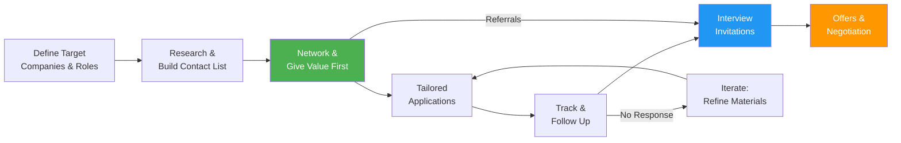

# Lesson 003: Mastering the Remote ML Job Search Strategy in 2026

> **Job search** &nbsp;|&nbsp; Lesson 3 of 5 &nbsp;|&nbsp; August 1, 2026
> *Generated by [Wren Learning](https://github.com/vmercel/wren-learning) • beginner • conceptual style*

---

## Overview

Having a great portfolio is only half the battle — you need a systematic strategy to get it in front of the right people. This lesson teaches you exactly where to find remote ML jobs, how to build a search pipeline that runs like a well-oiled machine, and how to stand out in a sea of applicants before you ever submit a résumé.

## 💡 Why 'Spray and Pray' Fails — and What Works Instead

Most job seekers treat their search like buying lottery tickets: they blast the same generic résumé to hundreds of openings and hope something sticks. This almost never works for competitive remote ML roles.

**The problem is simple math:**
- A single remote ML posting on a popular board can attract **500–2,000+ applicants**.
- Automated screening tools (ATS) reject roughly **75%** of applications before a human ever sees them.
- Only about **2–5%** of cold applicants get an interview.

> A strategic job search is the opposite of spraying and praying. It's about **targeting fewer, better-matched opportunities** and investing real effort into each one.

Think of it as **spearfishing vs. casting a wide net**. A spearfisher studies the water, picks a specific fish, and strikes with precision. That's your goal.

## 🌟 The Fishing Analogy: Your Job Search as an Expedition

Imagine you're a deep-sea fisher heading out to catch a specific, valuable fish — say, bluefin tuna.

| Fishing Step | Job Search Equivalent |
|---|---|
| **Study where tuna swim** | Research which companies hire remote ML engineers |
| **Pick the right season** | Time your applications to hiring cycles and funding rounds |
| **Use the right bait** | Tailor your résumé, cover letter, and portfolio to each role |
| **Build relationships with the harbor crew** | Network with employees and recruiters at target companies |
| **Track your trips in a logbook** | Maintain a job search tracker (spreadsheet or tool) |
| **Adjust based on results** | Analyze which strategies yield interviews and double down |

A random fisher who drops a line anywhere and waits will starve. A strategic fisher who knows the waters will eat well. **Your search is an expedition, not a gamble.**

## 💡 Where Remote ML Jobs Actually Live in 2026

Not all job boards are created equal. Remote ML roles cluster on specific platforms, and many of the best positions **never appear on mainstream boards** at all.

### Tier 1 — Specialized ML & AI Job Boards
These are your highest-signal sources:
- **ai-jobs.net** — Focused entirely on AI/ML roles, many remote
- **MLContests Jobs** — Connected to the ML competition community
- **Hugging Face Jobs** — Listings from the open-source ML ecosystem
- **Key(values)** — Matches engineers to companies by culture & values

### Tier 2 — Remote-First Job Platforms
- **Wellfound (formerly AngelList)** — Startup-heavy, strong remote filter
- **We Work Remotely** — One of the oldest remote-specific boards
- **Remotive** — Curated remote jobs, good ML section
- **Turing.com / Toptal** — Talent platforms that match you to remote roles

### Tier 3 — General Platforms (Use with Precision)
- **LinkedIn Jobs** — Massive volume; use advanced filters ("remote" + "machine learning")
- **Indeed** — Broad but useful with the right keywords
- **Company career pages directly** — Often list roles before they hit boards

### The Hidden Market (Tier 0)
> **An estimated 40–70% of jobs are never publicly posted.** They're filled through referrals, internal moves, or direct outreach.

This is why networking and visibility (covered next) are not optional — they're the most powerful channel.

## ✍️ Building Your Target Company List

Rather than searching randomly, build a **curated list of 20–40 target companies** that match your criteria. Here's how:

**Step 1: Define Your Filters**
- ✅ Remote-friendly or remote-first?
- ✅ What ML domain? (NLP, computer vision, recommender systems, MLOps, etc.)
- ✅ Company stage? (Startup, scale-up, enterprise)
- ✅ Geography restrictions? (Some "remote" roles are limited to certain time zones or countries)
- ✅ Compensation expectations?

**Step 2: Research Sources**
- **Glassdoor / Levels.fyi** — Compensation data and reviews
- **Crunchbase** — Funding rounds (recently funded companies = active hiring)
- **GitHub Trending / Papers With Code** — See which companies are publishing and open-sourcing
- **"Remote ML companies" curated lists** — Several community-maintained lists exist on GitHub

**Step 3: Create a Simple Tracker**

| Company | Role | Source | Status | Contact | Date Applied | Follow-up |
|---------|------|--------|--------|---------|-------------|----------|
| Acme AI | Sr. ML Eng | LinkedIn | Applied | jane@acme.ai | 2026-03-15 | 2026-03-22 |
| DataCo | MLOps | Referral | Intro call | via Tom | 2026-03-17 | — |

> **Pro tip:** Use a tool like Notion, Airtable, or even a simple Google Sheet. The key is **tracking every interaction** so nothing falls through the cracks.

## 💡 Networking Without Being Awkward

**Networking** means building genuine professional relationships — not spamming strangers with "Please refer me!" messages. Think of it as planting seeds months before harvest.

### The GIVE-First Framework
Before you ever ask for anything, **give value first**:

1. **Engage with their work** — Comment thoughtfully on their blog posts, papers, or tweets. Share their open-source projects with your audience.
2. **Offer help** — See a bug in their repo? Submit a fix. They're looking for beta testers? Volunteer.
3. **Create visible work** — Write blog posts referencing their research. Build demos using their tools. Tag them respectfully.
4. **Connect at events** — Virtual ML meetups, Discord/Slack communities (MLOps Community, Weights & Biases forums, fast.ai), and conferences.
5. **Then ask warmly** — After several genuine interactions: *"I see your team is hiring for X. I've been working on [relevant project]. Would you be open to a quick chat or referral?"*

### Where to Network for Remote ML Roles
- **Twitter/X and Bluesky ML communities** — Many ML hiring managers post roles here first
- **Discord servers** — MLOps Community, Hugging Face, LangChain, PyTorch
- **LinkedIn** — But use it for thoughtful engagement, not cold spam
- **Virtual conferences** — NeurIPS, ICML, and smaller community events often have job boards and networking sessions

> **Referrals are 5–10× more likely to result in a hire than cold applications.** This single fact should reshape how you allocate your job search time.

## ✍️ Your Weekly Search Rhythm: The 10-Hour Plan

A job search is itself a project. Treat it like one with a weekly cadence:

| Day | Activity | Time |
|-----|----------|------|
| **Monday** | Scan job boards, update target list, identify 3–5 roles to apply for | 2 hrs |
| **Tuesday** | Tailor résumé & cover letter for Role 1–2; submit | 2 hrs |
| **Wednesday** | Tailor & submit Role 3–5; send follow-up emails | 2 hrs |
| **Thursday** | Networking: engage on social, attend a virtual event, reach out to 2–3 contacts | 2 hrs |
| **Friday** | Review tracker, analyze what's working, update portfolio or practice interview skills | 2 hrs |

### Key Principles
- **Quality over quantity**: 5 tailored applications beat 50 generic ones
- **Consistency beats intensity**: 10 hours/week for 8 weeks beats 40 hours in one frantic week
- **Track and iterate**: If you've sent 20 tailored applications with zero responses, something in your materials needs fixing — not your effort level

> 💡 **Set a "search sprint" of 8–12 weeks.** This prevents burnout and creates urgency. Re-evaluate your strategy at the halfway point.

## 💡 Tailoring Your Application: The 80/20 Rule

You don't need to rewrite your entire résumé for every role. Use the **80/20 approach**:

- **80% stays the same** — Your core experience, education, skills, and portfolio links
- **20% is customized** — The summary/objective, the order and emphasis of bullet points, and specific keywords

### How to Customize the 20%

1. **Read the job description like a detective.** Highlight every skill, tool, and responsibility mentioned.
2. **Mirror their language.** If they say "LLM fine-tuning," don't write "large language model adaptation." Use their exact terms — this also helps with ATS keyword matching.
3. **Reorder your bullet points** so the most relevant experience appears first under each role.
4. **Write a 2–3 sentence summary** at the top that directly maps to their top requirements.
5. **Reference the company specifically** in your cover letter or email. Mention a recent blog post, product launch, or paper they published.

> **ATS (Applicant Tracking System):** Software that companies use to automatically scan, filter, and rank résumés based on keywords and formatting. If your résumé doesn't pass the ATS, no human will ever read it.

## 📊 The Full Search Pipeline — Visual Overview

Below is a visual map of how each stage of your job search feeds into the next. Notice that networking feeds into every stage — it's not a separate activity but an accelerant for the entire pipeline.

## Diagram

## Key Concepts

| Term | Definition |
|------|------------|
| **Hidden Job Market** | The large share (estimated 40–70%) of job openings that are filled through referrals, internal moves, or direct outreach and never appear on public job boards. |
| **ATS (Applicant Tracking System)** | Software used by employers to automatically scan, filter, and rank incoming résumés by keywords, formatting, and criteria before a human reviewer ever sees them. |
| **GIVE-First Networking** | A networking approach where you provide genuine value — sharing work, offering help, engaging with content — before making any requests, building trust and reciprocity. |
| **Target Company List** | A curated list of 20–40 companies that match your criteria for role type, remote policy, domain, and culture — serving as the foundation of a focused job search. |
| **80/20 Application Tailoring** | The practice of keeping 80% of your résumé constant while customizing 20% — summary, keyword emphasis, and bullet order — to match each specific job description. |

## Real-World Analogy

> Your job search is like a deep-sea fishing expedition. Random fishers who drop a line anywhere and hope for the best will come home empty-handed. Expert fishers study where the fish swim (target company research), pick the right season (timing and hiring cycles), use specialized bait (tailored applications), and build relationships with the harbor crew who know where the big catches are (networking). Every successful expedition is planned, tracked, and adjusted — never left to chance.

## Today's Takeaways

- [ ] Build a curated list of 20–40 target companies and track every interaction in a simple spreadsheet — a focused search dramatically outperforms a scattered one.
- [ ] Invest at least 20% of your search time in networking and giving value first; referrals are 5–10× more effective than cold applications.
- [ ] Tailor 20% of every application (summary, keywords, bullet order) to mirror the job description's exact language — this is how you beat both ATS filters and human reviewers.

## Knowledge Check

**Why is the 'hidden job market' so important for remote ML job seekers to understand?**

- A) Because an estimated 40–70% of positions are filled through referrals and direct outreach, never appearing on public job boards
- B) Because hidden jobs pay significantly more than publicly posted positions
- C) Because hidden jobs don't require technical interviews
- D) Because ATS systems automatically post all jobs to hidden channels first

See Answer

**Answer: A) Because an estimated 40–70% of positions are filled through referrals and direct outreach, never appearing on public job boards**

The hidden job market refers to the large share of positions filled through referrals, networking, and direct outreach before they're ever posted publicly. This is why networking is so critical — it gives you access to opportunities most applicants never even see. The other options are incorrect: hidden jobs don't inherently pay more or skip interviews, and ATS systems manage applications for posted roles, not hidden ones.

---

*Part of the [Job search](https://github.com/vmercel/wren-learning/job-search) learning campaign &nbsp;•&nbsp; [View all lessons](https://github.com/vmercel/wren-learning)*
