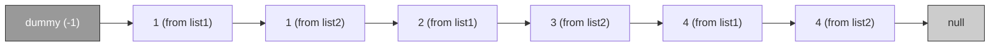

# Lesson 005: Merge Two Sorted Lists: Building with Linked Lists

> **LeetCode** &nbsp;|&nbsp; Lesson 5 of 30 &nbsp;|&nbsp; August 1, 2026
> *Generated by [Wren Learning](https://github.com/vmercel/wren-learning) • beginner • practical style*

---

## Overview

Today you'll tackle LeetCode #21 — Merge Two Sorted Lists. This classic problem introduces you to the linked list data structure and teaches you the powerful technique of merging sorted data, a fundamental building block used in algorithms like Merge Sort.

## 💡 What Is a Linked List?

Before we solve the problem, we need to understand the data structure it uses.

A **linked list** is a chain of **nodes**. Each node holds two things:
1. **A value** (the data it stores)
2. **A pointer** (a reference to the *next* node in the chain)

The last node's pointer is `null` (meaning "nothing comes after me").

| Feature | Array | Linked List |
|---|---|---|
| Access by index | ✅ Fast (O(1)) | ❌ Slow (O(n)) |
| Insert at beginning | ❌ Slow (O(n)) | ✅ Fast (O(1)) |
| Memory layout | Contiguous | Scattered |
| Size | Fixed (usually) | Dynamic |

> Think of a linked list like a **treasure hunt** where each clue tells you where the next clue is. You can't jump to clue #5 directly — you must follow the chain from clue #1.

## 💡 The Problem: Merge Two Sorted Lists

**LeetCode #21 — Easy**

You are given the heads of two **sorted** linked lists `list1` and `list2`. Merge them into one **sorted** linked list and return its head.

**Example:**
```
list1: 1 → 2 → 4
list2: 1 → 3 → 4
Result: 1 → 1 → 2 → 3 → 4 → 4
```

**Constraints:**
- Both lists are sorted in **non-decreasing** order
- The number of nodes in each list is in the range `[0, 50]`
- Node values range from `-100` to `100`

> **Key insight:** Because both lists are *already sorted*, you don't need to sort anything. You just need to **pick the smaller value** at each step, like a zipper merging two rows of teeth.

## 🌟 The Zipper Analogy

Imagine you're a **librarian** with two carts of books, each already organized alphabetically:

- **Cart A:** Austen, Dickens, Hemingway
- **Cart B:** Brontë, Fitzgerald, Tolkien

To merge them onto one shelf in order, you:
1. Compare the first book on each cart
2. Place the one that comes first alphabetically onto the shelf
3. Move to the next book on whichever cart you just took from
4. Repeat until both carts are empty

Result: Austen, Brontë, Dickens, Fitzgerald, Hemingway, Tolkien ✅

You never re-sort. You just **compare and pick** — that's exactly what our algorithm does!

## 📊 Visualizing the Merge Step by Step

Let's trace through merging `1 → 2 → 4` and `1 → 3 → 4`:

| Step | list1 pointer | list2 pointer | Compare | Pick | Result so far |
|------|--------------|--------------|---------|------|---------------|
| 1 | **1** → 2 → 4 | **1** → 3 → 4 | 1 ≤ 1 | list1's 1 | 1 |
| 2 | **2** → 4 | **1** → 3 → 4 | 2 > 1 | list2's 1 | 1 → 1 |
| 3 | **2** → 4 | **3** → 4 | 2 ≤ 3 | list1's 2 | 1 → 1 → 2 |
| 4 | **4** | **3** → 4 | 4 > 3 | list2's 3 | 1 → 1 → 2 → 3 |
| 5 | **4** | **4** | 4 ≤ 4 | list1's 4 | 1 → 1 → 2 → 3 → 4 |
| 6 | null | **4** | list1 empty | list2's 4 | 1 → 1 → 2 → 3 → 4 → 4 |

> When one list is exhausted, just **attach the remainder** of the other list. No more comparisons needed!

## 💡 The Dummy Node Trick

There's one practical challenge: when building the result list, **which node is the head?** You don't know until you compare the first elements.

The elegant solution is a **dummy node** (also called a sentinel):

- Create a fake node at the start (value doesn't matter)
- Build the merged list after it
- Return `dummy.next` as the real head

> It's like putting a blank cover page on your report. You build everything after it, then remove the cover page when you hand it in. This avoids ugly special-case code for the first node.

## 💻 The Iterative Solution (Python)

```python
# Definition for singly-linked list.
# class ListNode:
#     def __init__(self, val=0, next=None):
#         self.val = val
#         self.next = next

def mergeTwoLists(list1, list2):
    # Step 1: Create a dummy node to simplify edge cases
    dummy = ListNode(-1)
    current = dummy  # 'current' is our building pointer
    
    # Step 2: Compare and pick the smaller node
    while list1 and list2:
        if list1.val <= list2.val:
            current.next = list1
            list1 = list1.next      # advance list1's pointer
        else:
            current.next = list2
            list2 = list2.next      # advance list2's pointer
        current = current.next      # advance our building pointer
    
    # Step 3: Attach whichever list still has remaining nodes
    current.next = list1 if list1 else list2
    
    # Step 4: Return the real head (skip the dummy)
    return dummy.next
```

**Line-by-line breakdown:**
- `dummy = ListNode(-1)` — Our placeholder starting node
- `current = dummy` — A pointer we move forward as we add nodes
- The `while` loop runs as long as **both** lists have nodes left
- `current.next = list1` — We don't *create* new nodes; we *redirect pointers*
- `current.next = list1 if list1 else list2` — Attach the leftover tail

## 💡 Complexity Analysis

Let **n** = length of list1 and **m** = length of list2.

| Metric | Value | Why |
|--------|-------|-----|
| **Time** | O(n + m) | We visit each node exactly once |
| **Space** | O(1) | We reuse existing nodes; no new list created |

> This is as efficient as it gets! You can't do better than O(n + m) because you *must* look at every node to know where it belongs.

## 💻 Bonus: The Recursive Solution

Some people find recursion more elegant. The idea: **the merged list is the smaller head followed by the merge of the remaining nodes.**

```python
def mergeTwoLists(list1, list2):
    # Base cases: if one list is empty, return the other
    if not list1:
        return list2
    if not list2:
        return list1
    
    # Recursive case: pick the smaller head
    if list1.val <= list2.val:
        list1.next = mergeTwoLists(list1.next, list2)
        return list1
    else:
        list2.next = mergeTwoLists(list1, list2.next)
        return list2
```

⚠️ **Trade-off:** The recursive version uses **O(n + m) space** on the call stack. The iterative version uses **O(1) space**. In interviews, know both but mention this difference.

## ✍️ Edge Cases to Always Consider

Before submitting any linked list problem, check these:

1. **Both lists empty** → Return `null`
2. **One list empty** → Return the other list as-is
3. **Lists of different lengths** → The leftover tail gets attached
4. **All elements the same** → `1→1→1` and `1→1→1` → `1→1→1→1→1→1`
5. **Single-element lists** → `5` and `3` → `3→5`

> 🎯 **Interview tip:** Mention these edge cases out loud before coding. It shows thoroughness and often catches bugs before they happen.

## ✍️ Your Turn: Practice Exercise

1. **Solve it yourself** on [LeetCode #21](https://leetcode.com/problems/merge-two-sorted-lists/) before looking at the solution above
2. **Try both versions** — iterative first, then recursive
3. **Challenge extension:** After solving, try LeetCode #23 (Merge k Sorted Lists) — it builds directly on this concept
4. **Dry run on paper:** Trace through merging `2 → 5 → 7` and `1 → 3 → 6 → 8`. Write out each step like the table above.

> **Expected result:** `1 → 2 → 3 → 5 → 6 → 7 → 8`

## Diagram



## Key Concepts

| Term | Definition |
|------|------------|
| **Linked List** | A data structure where each element (node) contains a value and a pointer/reference to the next node in the sequence. |
| **Node** | A single element in a linked list, storing a value and a reference to the next node. |
| **Dummy Node (Sentinel)** | A temporary placeholder node placed at the start of a list to simplify construction logic and avoid special-casing the head. |
| **Two-Pointer Merge** | A technique where you maintain a pointer in each sorted list and repeatedly pick the smaller element to build a merged result. |
| **In-Place Merging** | Merging by redirecting existing node pointers rather than creating new nodes, achieving O(1) extra space. |

## Real-World Analogy

> Imagine two single-file lines of students already sorted by height, waiting to board a bus. The teacher stands at the bus door and always picks the shorter student from the front of either line. When one line is empty, the remaining students from the other line board in order. No re-sorting needed — just compare, pick, and move forward. The teacher's clipboard where she first writes 'START' before listing names is the dummy node.

## Today's Takeaways

- [ ] Linked lists store data as a chain of nodes connected by pointers — you traverse them sequentially, not by index
- [ ] When merging two sorted lists, use two pointers and always pick the smaller value — this runs in O(n + m) time
- [ ] The dummy node trick eliminates special-case code for the head and is a pattern you'll reuse in many linked list problems

## Knowledge Check

**When merging two sorted linked lists iteratively, why do we use a dummy (sentinel) node?**

- A) To avoid special-case logic for initializing the head of the merged list
- B) To store the total count of nodes in both lists
- C) To make the algorithm run in O(1) time complexity
- D) To reverse the final merged list before returning

<details>
<summary>See Answer</summary>

**Answer: A) To avoid special-case logic for initializing the head of the merged list**

The dummy node gives us a stable starting point so we can always do `current.next = ...` without worrying about whether `current` has been initialized. Without it, we'd need an if-statement to handle the very first node separately. It has nothing to do with counting nodes, time complexity improvements, or reversing — those are unrelated concerns.

</details>

---

*Part of the [LeetCode](https://github.com/vmercel/wren-learning/leetcode) learning campaign &nbsp;•&nbsp; [View all lessons](https://github.com/vmercel/wren-learning)*
