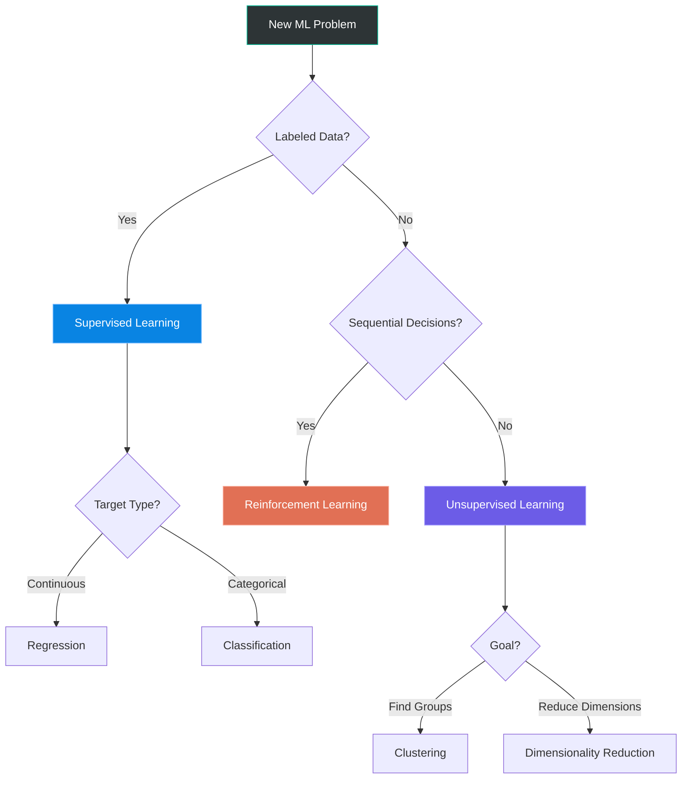

# Lesson 001: The ML Landscape: How Machines Actually Learn

> **Machine Learning Algorithms** &nbsp;|&nbsp; Lesson 1 of 5 &nbsp;|&nbsp; August 1, 2026
> *Generated by [Wren Learning](https://github.com/vmercel/wren-learning) • advanced • practical style*

---

## Overview

Every recommendation Netflix serves you, every fraud alert your bank fires, every voice command Siri understands — they all trace back to a handful of core learning paradigms. This opening lesson maps the entire machine learning landscape so you can navigate it like an expert across the next five lessons.

## 💡 Why This Matters Right Now

Machine learning isn't a single algorithm — it's an **ecosystem of strategies** for extracting patterns from data. Choosing the wrong strategy is like bringing a fishing rod to a deer hunt: the tool works, just not for your problem.

Over this 5-lesson series, you'll master:

| Lesson | Focus |
|--------|-------|
| **1 (Today)** | The ML landscape & learning paradigms |
| **2** | Supervised learning — regression & classification |
| **3** | Unsupervised learning — clustering & dimensionality reduction |
| **4** | Ensemble methods & model selection |
| **5** | Neural networks & deep learning foundations |

By the end, you won't just *know* algorithms — you'll know **when and why** to deploy each one.

## 💡 The Three Paradigms of Machine Learning

Every ML algorithm falls into one of three fundamental paradigms based on **what kind of feedback the model receives during training**:

### 1. Supervised Learning
- **Input:** Labeled data (features + correct answers)
- **Goal:** Learn a mapping from input → output
- **Examples:** Spam detection, house price prediction, medical diagnosis
- **Key insight:** The model has a "teacher" — ground truth labels guide every update

### 2. Unsupervised Learning
- **Input:** Unlabeled data (features only, no answers)
- **Goal:** Discover hidden structure — clusters, patterns, anomalies
- **Examples:** Customer segmentation, topic modeling, anomaly detection
- **Key insight:** No teacher — the algorithm must find order in chaos

### 3. Reinforcement Learning
- **Input:** An environment that returns rewards/penalties for actions
- **Goal:** Learn a policy that maximizes cumulative reward
- **Examples:** Game-playing agents (AlphaGo), robotics, autonomous driving
- **Key insight:** No dataset at all — the agent generates its own experience through trial and error

> **Expert nuance:** These boundaries blur in practice. Semi-supervised learning uses a small labeled set plus a large unlabeled set. Self-supervised learning (used in GPT, BERT) creates artificial labels from raw data. Real-world ML pipelines often **chain paradigms together**.

## 🌟 The Restaurant Kitchen Analogy

Imagine you're training a new chef:

🍳 **Supervised Learning** = You hand them a recipe book with photos of finished dishes. For every dish they attempt, you compare it to the photo and give corrections. *"This risotto needs 2 more minutes."*

🔍 **Unsupervised Learning** = You dump 500 unlabeled ingredients on the counter and say *"Group these however makes sense."* The chef discovers that some are proteins, some are spices, some are dairy — without ever being told those categories exist.

🎮 **Reinforcement Learning** = You let the chef experiment freely. When diners love a dish, tip generously (reward). When they send it back, the chef loses time (penalty). Over thousands of meals, the chef converges on a winning menu — without **ever** seeing a recipe.

## 💡 The Anatomy of Every ML Algorithm

Regardless of paradigm, every ML algorithm shares **four core components**. Understanding this skeleton lets you reason about *any* new algorithm you encounter:

1. **Representation** — How does the model structure its knowledge?
   - A linear equation? A decision tree? A neural network graph?
   - This defines the **hypothesis space** — the set of all patterns the model *could possibly* learn

2. **Evaluation (Loss Function)** — How do we measure "wrong"?
   - Mean Squared Error for regression, Cross-Entropy for classification, Silhouette Score for clustering
   - The loss function is the model's **compass** — it defines what "better" means

3. **Optimization** — How does the model improve?
   - Gradient descent, evolutionary strategies, greedy splitting
   - This is the **engine** that actually moves parameters toward better solutions

4. **Generalization** — Will it work on data it hasn't seen?
   - Regularization, cross-validation, early stopping
   - This is the ultimate test — a model that memorizes training data is **useless**

> **Critical distinction:** Overfitting means your model learned the noise in training data. Underfitting means it didn't learn the signal. The entire craft of ML is navigating the **bias-variance tradeoff** between these two failure modes.

## ✍️ Algorithm Selection: A Decision Framework

Faced with a new problem, experts don't randomly try algorithms. They ask a **decision chain**:

```
1. Do I have labeled data?
   ├── YES → Supervised Learning
   │   ├── Is the target continuous? → Regression (Linear, Ridge, SVR, XGBoost)
   │   └── Is the target categorical? → Classification (Logistic Reg, SVM, Random Forest, Neural Nets)
   ├── NO → Unsupervised Learning
   │   ├── Do I want groups? → Clustering (K-Means, DBSCAN, Hierarchical)
   │   └── Do I want fewer features? → Dim. Reduction (PCA, t-SNE, UMAP)
   └── SEQUENTIAL DECISIONS? → Reinforcement Learning (Q-Learning, PPO, A3C)
```

**But that's just the starting point.** You also consider:
- **Dataset size:** <1K samples? Avoid deep learning. Use SVMs or tree-based methods.
- **Interpretability needs:** Regulated industries (healthcare, finance) often require explainable models like logistic regression or decision trees.
- **Latency constraints:** A model in a trading system must predict in microseconds — ruling out large ensembles.
- **Data type:** Tabular data? Tree-based ensembles dominate. Images? CNNs. Text? Transformers.

## 💡 The Bias-Variance Tradeoff Visualized

This is arguably the **single most important concept** in all of machine learning. Every model error decomposes into:

| Component | Meaning | Symptom |
|-----------|---------|--------|
| **Bias** | Error from overly simple assumptions | Model misses the real pattern (underfitting) |
| **Variance** | Error from sensitivity to training data fluctuations | Model captures noise as if it were signal (overfitting) |
| **Irreducible Error** | Noise inherent in the problem | Can't be eliminated by any model |

**Total Error = Bias² + Variance + Irreducible Error**

> As you increase model complexity (more parameters, deeper trees), **bias decreases but variance increases**. The sweet spot is where their sum is minimized. This is why we use validation sets — to detect when we've crossed from learning signal to memorizing noise.

## Diagram



## Key Concepts

| Term | Definition |
|------|------------|
| **Supervised Learning** | A paradigm where the model learns from labeled examples — input-output pairs — to predict outputs for unseen inputs. |
| **Unsupervised Learning** | A paradigm where the model discovers hidden patterns or structure in data without any labeled answers. |
| **Reinforcement Learning** | A paradigm where an agent learns by interacting with an environment, receiving rewards or penalties for its actions. |
| **Bias-Variance Tradeoff** | The fundamental tension between a model's ability to fit training data closely (low bias) and its ability to generalize to new data (low variance). |
| **Loss Function** | A mathematical function that quantifies how wrong a model's predictions are, serving as the objective the optimization process minimizes. |
| **Overfitting** | When a model memorizes training data — including its noise — and fails to generalize to unseen data. |

## Real-World Analogy

> Think of ML paradigms like three ways to learn a new city. Supervised learning is using a GPS with turn-by-turn directions — someone already mapped every route for you. Unsupervised learning is wandering the city without a map, gradually noticing that restaurants cluster near the waterfront and offices cluster downtown. Reinforcement learning is driving for a rideshare app — you try different routes, and your tips (rewards) teach you which streets are fastest at which times. Each approach works, but choosing the right one depends on what resources you have and what you're trying to accomplish.

## Today's Takeaways

- [ ] All ML algorithms share four components: representation, evaluation (loss), optimization, and generalization — learn to identify these in any algorithm you encounter.
- [ ] The choice between supervised, unsupervised, and reinforcement learning is determined by your data (labeled vs. unlabeled) and problem structure (prediction vs. discovery vs. sequential decisions).
- [ ] The bias-variance tradeoff is the central tension in ML: too simple a model misses patterns, too complex a model memorizes noise — mastering this tradeoff is the essence of the craft.

## Knowledge Check

**You have a dataset of 50,000 customer transactions with NO labels, and your business team wants to identify natural groups of customers for targeted marketing. Which learning paradigm and technique is most appropriate?**

- A) Unsupervised learning — clustering (e.g., K-Means)
- B) Supervised learning — classification (e.g., Random Forest)
- C) Reinforcement learning — policy optimization (e.g., Q-Learning)
- D) Supervised learning — regression (e.g., Linear Regression)

<details>
<summary>See Answer</summary>

**Answer: A) Unsupervised learning — clustering (e.g., K-Means)**

With no labels and a goal of finding natural groups, this is a textbook unsupervised clustering problem. Supervised learning (B and D) requires labeled data, which we don't have. Reinforcement learning (C) is for sequential decision-making with an environment that provides rewards, not for static dataset analysis. K-Means or similar clustering algorithms will discover customer segments from the transaction patterns alone.

</details>

---

*Part of the [Machine Learning Algorithms](https://github.com/vmercel/wren-learning/machine-learning-algorithms) learning campaign &nbsp;•&nbsp; [View all lessons](https://github.com/vmercel/wren-learning)*
