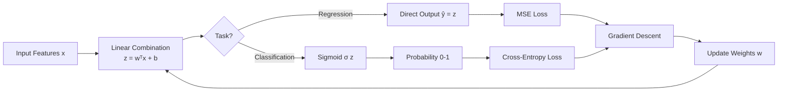

# Lesson 002: Linear Models: Regression & Classification from Scratch

> **Machine Learning Algorithms** &nbsp;|&nbsp; Lesson 2 of 5 &nbsp;|&nbsp; August 1, 2026
> *Generated by [Wren Learning](https://github.com/vmercel/wren-learning) • advanced • practical style*

---

## Overview

Linear models are the workhorses of machine learning — simple enough to interpret, powerful enough to ship to production. This lesson dissects linear regression and logistic regression, revealing the optimization mechanics under the hood and when each model shines or fails catastrophically.

## 💡 Why Linear Models Still Matter

In Lesson 1, we established that ML algorithms learn patterns from data. Linear models are the **simplest parametric family** that does this — and simplicity is a feature, not a bug.

**Why you should care even in the age of deep learning:**

- **Interpretability**: Coefficients directly tell you *how much* each feature contributes. Regulated industries (finance, healthcare) often require this.
- **Speed**: Training on millions of rows in seconds. No GPU needed.
- **Baseline discipline**: If a linear model gets 92% accuracy, your complex ensemble at 93% may not justify the operational cost.
- **Surprisingly competitive**: With good feature engineering, linear models win many Kaggle competitions and power production systems at scale (ad click prediction at Google, spam filters).

> "If you can't beat a linear model, you don't understand your data yet." — Common ML proverb

## 💡 Linear Regression: Fitting a Line Through Reality

**The core idea**: Predict a continuous target `y` as a weighted sum of input features.

**The equation:**

`ŷ = w₁x₁ + w₂x₂ + ... + wₙxₙ + b`

where `w` = weights (slopes), `b` = bias (intercept), and `x` = features.

**What "training" means**: Find the weights that minimize the **Mean Squared Error (MSE)**:

`MSE = (1/n) Σ(yᵢ - ŷᵢ)²`

**Two ways to solve:**

| Method | How it works | When to use |
|---|---|---|
| **Normal Equation** | Closed-form matrix solution: `w = (XᵀX)⁻¹Xᵀy` | Small datasets (< 10K features) |
| **Gradient Descent** | Iteratively nudge weights downhill on the loss surface | Large datasets, streaming data |

**Critical nuance — the Normal Equation inverts a matrix**. If `XᵀX` is singular (multicollinear features), it fails. This is why **regularization** exists (covered next).

## 💡 The Gradient Descent Engine

Gradient descent is the **universal optimizer** you'll encounter in nearly every ML algorithm. Master it here; reuse it everywhere.

**The algorithm:**

1. Initialize weights randomly (or to zero)
2. Compute the gradient (slope of loss w.r.t. each weight)
3. Update: `w = w - α · ∂Loss/∂w`
4. Repeat until convergence

**α (learning rate)** is the most important hyperparameter:

- **Too large** → Overshoots the minimum, loss oscillates or diverges
- **Too small** → Converges painfully slowly
- **Just right** → Smooth descent to the optimal weights

**Variants you must know:**

| Variant | Batch Size | Trade-off |
|---|---|---|
| **Batch GD** | Entire dataset | Stable but slow on big data |
| **Stochastic GD (SGD)** | 1 sample | Fast but noisy updates |
| **Mini-batch GD** | 32–512 samples | Best of both — the industry default |

> **Expert tip**: Modern optimizers like **Adam** adapt the learning rate per-parameter. Start with Adam; switch to SGD with momentum for fine-tuning when you need that last 0.1% performance.

## 🌟 Analogy: The Blindfolded Hiker

Imagine you're **blindfolded on a mountainside** and need to reach the valley floor (the minimum loss).

- You can't see the landscape, but you can **feel the slope under your feet** (the gradient).
- Each step you take is proportional to **how steep the slope is** — big steps on steep slopes, tiny steps near the valley.
- Your **step size** is the learning rate. Too big and you leap over the valley. Too small and you're still hiking at midnight.
- **Stochastic GD** is like feeling the slope with one foot — noisy but fast. **Batch GD** is lying flat to feel the entire slope — accurate but slow.

The valley floor is where your model's predictions best match reality.

## 💡 Regularization: Taming Overfit Linear Models

Raw linear regression will happily assign enormous weights to noisy features, **memorizing training data** instead of learning the signal.

**Regularization adds a penalty for large weights to the loss function:**

| Technique | Penalty Term | Effect | Use When |
|---|---|---|---|
| **Ridge (L2)** | `λ Σ wᵢ²` | Shrinks all weights toward zero | Many small-effect features |
| **Lasso (L1)** | `λ Σ |wᵢ|` | Drives some weights to **exactly zero** | Feature selection needed |
| **Elastic Net** | `λ₁ Σ |wᵢ| + λ₂ Σ wᵢ²` | Combines both | Correlated features + sparsity |

**λ (regularization strength)** controls the trade-off:
- `λ = 0` → No regularization (standard linear regression)
- `λ → ∞` → All weights go to zero (underfitting)

> **Production insight**: Always standardize features (zero mean, unit variance) before applying regularization. Otherwise, features on different scales get penalized unevenly — a weight of 1000 for "age in days" vs. 0.01 for "age in years" doesn't mean the first feature matters more.

## 💡 Logistic Regression: Classification with a Linear Core

**The twist**: What if the target is a **class label** (spam/not-spam) instead of a continuous number?

You can't use MSE on a 0/1 target — predictions would spill outside [0, 1]. Instead:

1. Compute the linear combination: `z = wᵀx + b`
2. Squeeze through the **sigmoid function**: `σ(z) = 1 / (1 + e⁻ᶻ)`
3. Output is now a **probability** between 0 and 1

**Loss function — Binary Cross-Entropy:**

`Loss = -[y·log(ŷ) + (1-y)·log(1-ŷ)]`

This punishes confident wrong predictions exponentially harder than uncertain ones.

**Decision boundary**: Logistic regression draws a **straight line** (or hyperplane) separating classes. If the true boundary is curved, you must:
- Engineer polynomial features (`x₁²`, `x₁·x₂`)
- Or use a nonlinear model (next lessons)

**Multiclass extension**: Use **softmax regression** (one-vs-rest or multinomial) — the sigmoid generalizes to K classes, outputting a probability distribution.

## ✍️ Hands-On: Diagnosing a Linear Model

You've trained a linear regression to predict house prices. Here's what you observe:

```
Training MSE:  12,400
Test MSE:      89,300
Top 3 weights: [zip_code: 45,200, sqft: 320, bedrooms: -12,500]
```

**Diagnose these issues:**

1. **Massive train-test gap** → Classic **overfitting**. The model memorized training noise.
2. **zip_code has weight 45,200** → Zip code is likely being treated as a continuous number, not a category. A zip code of 90210 isn't "more" than 10001. **Fix**: One-hot encode categorical features.
3. **bedrooms is negative** → Counterintuitive but possibly valid (holding sqft constant, more bedrooms = smaller rooms = lower price). Or it signals **multicollinearity** with sqft.

**Action plan:**
- Apply **Ridge or Lasso regularization** to combat overfitting
- One-hot encode zip_code
- Check **Variance Inflation Factor (VIF)** for multicollinearity
- Standardize all features before regularization

## 💡 When Linear Models Break Down

Linear models assume a **linear relationship** between features and target. They fail when:

- **Nonlinear patterns**: Income vs. happiness is logarithmic, not linear
- **Feature interactions**: The effect of "has pool" depends on "climate zone" — a linear model misses this without explicit interaction terms
- **Complex decision boundaries**: Classifying images, natural language, or any high-dimensional manifold

**Diagnostic signals you've hit the wall:**

- Training error is high AND test error is high → **Underfitting** (high bias)
- Adding more data doesn't improve performance
- Residual plots show clear patterns (U-shapes, clusters)

> **The pragmatist's rule**: Start linear. If the residual plot screams nonlinearity, escalate to trees or neural networks (Lessons 3–4).

## Diagram



## Key Concepts

| Term | Definition |
|------|------------|
| **Linear Regression** | A model that predicts a continuous target as a weighted sum of input features, optimized by minimizing Mean Squared Error. |
| **Logistic Regression** | A classification model that passes a linear combination through a sigmoid function to output class probabilities, optimized with cross-entropy loss. |
| **Gradient Descent** | An iterative optimization algorithm that updates model parameters in the direction that reduces the loss function, controlled by a learning rate. |
| **Regularization (L1/L2)** | A penalty added to the loss function that discourages large weights, reducing overfitting. L1 (Lasso) promotes sparsity; L2 (Ridge) shrinks weights smoothly. |
| **Learning Rate (α)** | A hyperparameter controlling the step size during gradient descent — too large causes divergence, too small causes slow convergence. |
| **Sigmoid Function** | A function σ(z) = 1/(1+e⁻ᶻ) that squashes any real number into the (0, 1) range, enabling probability output for classification. |

## Real-World Analogy

> A linear model is like a restaurant receipt calculator. Each item (feature) has a fixed price (weight), and the total bill (prediction) is just the sum of price × quantity for every item, plus tax (bias). Ridge regularization is like a restaurant policy that caps how expensive any single item can be — preventing one luxury dish from dominating the bill. Lasso is stricter: it removes items from the menu entirely if they don't contribute enough revenue. This simplicity makes receipts easy to audit (interpretable), but it can't capture complex dynamics like 'order champagne AND oysters together and the price triples' — that requires interaction terms or a more sophisticated pricing model.

## Today's Takeaways

- [ ] Linear regression minimizes MSE with a closed-form solution or gradient descent; logistic regression uses sigmoid + cross-entropy for classification — same optimization engine, different output layers.
- [ ] Regularization (Ridge, Lasso, Elastic Net) is not optional in practice — it prevents overfitting and, in Lasso's case, performs automatic feature selection by zeroing out irrelevant weights.
- [ ] Always start with a linear model as your baseline. If residuals show patterns or the train-test gap is small but error is high, you have a signal to escalate to nonlinear methods.

## Knowledge Check

**You're training a Lasso (L1) regression on a dataset with 200 features. After training, you notice 170 feature weights are exactly zero. What does this tell you?**

- A) Lasso performed feature selection — only 30 features are meaningfully predictive, and the regularization strength drove the rest to zero
- B) The model is severely overfitting because most weights are zero
- C) The learning rate was too high, causing most weights to collapse to zero
- D) The dataset has too few samples to support 200 features, so Lasso randomly eliminated features

<details>
<summary>See Answer</summary>

**Answer: A) Lasso performed feature selection — only 30 features are meaningfully predictive, and the regularization strength drove the rest to zero**

L1 regularization uniquely drives coefficients to exactly zero, effectively performing automatic feature selection. This is Lasso's defining property — it identifies the sparse subset of features that matter. Option B is backwards: sparsity from regularization combats overfitting. Option C is wrong because learning rate affects convergence speed, not which weights become zero. Option D is wrong because Lasso's elimination is not random — it's based on each feature's contribution to reducing loss relative to the regularization penalty.

</details>

---

*Part of the [Machine Learning Algorithms](https://github.com/vmercel/wren-learning/machine-learning-algorithms) learning campaign &nbsp;•&nbsp; [View all lessons](https://github.com/vmercel/wren-learning)*
