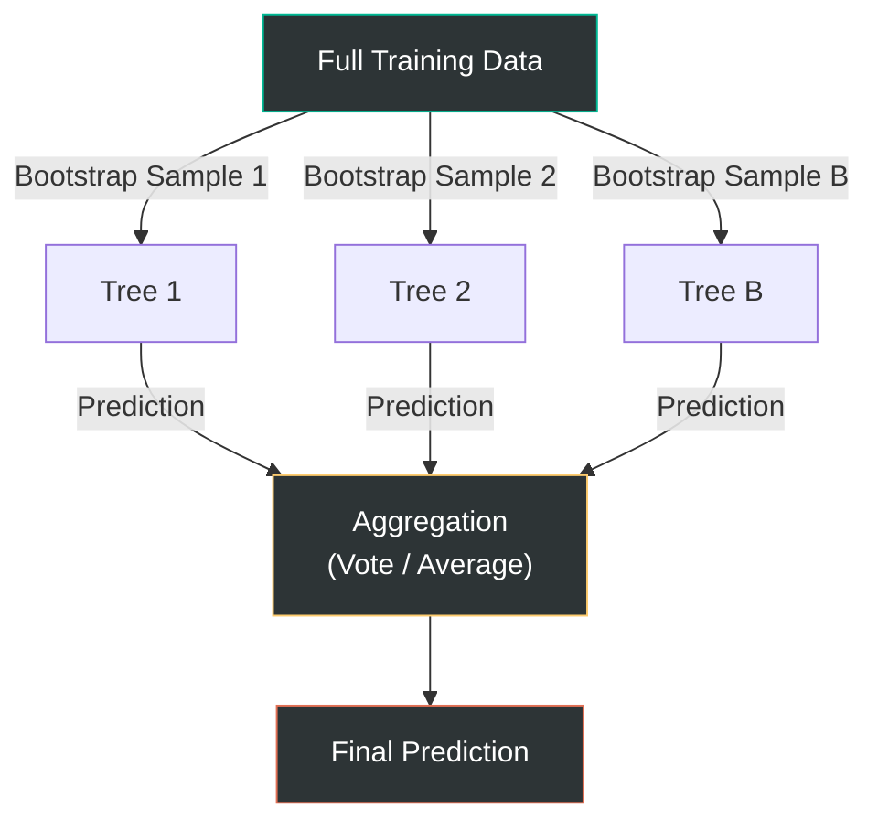

# Lesson 003: Decision Trees & Random Forests: Ensemble Power

> **Machine Learning Algorithms** &nbsp;|&nbsp; Lesson 3 of 5 &nbsp;|&nbsp; August 1, 2026
> *Generated by [Wren Learning](https://github.com/vmercel/wren-learning) • advanced • practical style*

---

## Overview

Linear models draw straight lines through data — but the real world is rarely that tidy. This lesson dives into decision trees, the intuition behind splitting data recursively, and how ensembles like Random Forests combine many weak learners into a powerhouse predictor. Understanding these algorithms is essential because tree-based methods dominate tabular data competitions and production ML systems alike.

## 💡 From Lines to Trees: Why We Need Non-Linear Models

In Lesson 2 we built linear models — powerful, interpretable, but fundamentally limited to **linear decision boundaries**. Consider predicting whether a loan defaults: the risk might spike when income is *low* **and** debt is *high* **and** employment tenure is *short*. That's a series of conditional rules, not a straight line.

**Decision trees** capture exactly this kind of reasoning. They partition the feature space into axis-aligned rectangles by asking a sequence of yes/no questions — mirroring how a human expert would triage cases.

> **Key insight:** A decision tree is a piecewise-constant model. Each leaf assigns a single prediction to all samples that land in its region. More leaves → more regions → more flexible (and more prone to overfitting).

## 💡 Anatomy of a Decision Tree

Every decision tree has three building blocks:

| Component | Role | Example |
|-----------|------|---------|
| **Root node** | First split on the most informative feature | `income < $45K?` |
| **Internal nodes** | Subsequent splits refining regions | `debt_ratio > 0.4?` |
| **Leaf nodes** | Terminal predictions (class label or mean value) | `Default = Yes` |

### How splits are chosen

At each node the algorithm evaluates every feature and every threshold, selecting the split that maximises **purity gain**:

- **Classification → Gini impurity or Information Gain (entropy)**
- **Regression → Variance reduction (MSE decrease)**

**Gini impurity** for a node with class proportions $p_1, p_2, \dots, p_K$:

$$G = 1 - \sum_{k=1}^{K} p_k^2$$

A pure node (all one class) has $G = 0$. The algorithm greedily picks the split that reduces the weighted average Gini across children the most.

### Stopping criteria & pruning

- **max_depth** — caps the tree height
- **min_samples_split / min_samples_leaf** — prevents tiny, noisy partitions
- **Post-pruning (cost-complexity pruning)** — grows a full tree, then removes branches that don't improve cross-validated performance

> Without constraints, a tree can memorise every training sample (one leaf per sample). Pruning is not optional — it's survival.

## 🌟 The Analogy: Sorting Mail in a Post Office

Imagine you're the head sorter in a massive post office. A mountain of letters arrives each morning. You set up a series of **sorting stations**:

1. **Station 1 (root):** "Is this letter domestic or international?" → Two conveyor belts diverge.
2. **Station 2:** "Is the zip code east or west of the Mississippi?" → Further split.
3. **Station 3:** "Is it a standard letter or a parcel?" → Further split.

Each station asks **one question** and sends items down exactly **one of two paths**. Letters that reach the final bin (leaf) get the same truck assignment.

A **Random Forest** is like hiring **500 sorters**, each given a *random subset* of letters and allowed to look at only a *random subset* of label info at each station. Each sorter builds their own routing scheme. When a new letter arrives, **all 500 sorters vote** on the correct truck. The majority wins — and the collective wisdom crushes any single sorter's errors.

## 💡 The Variance Problem: Why Single Trees Fail

Decision trees suffer from **high variance**: small changes in training data can produce wildly different tree structures. This is the classic **bias-variance trade-off** in action:

| Model | Bias | Variance | Typical Behaviour |
|-------|------|----------|-------------------|
| Shallow tree (depth 2-3) | High | Low | Underfits — misses patterns |
| Deep tree (no limits) | Low | High | Overfits — memorises noise |
| **Random Forest** | Low | **Low** | Sweet spot — aggregation tames variance |

> **Bias-variance decomposition:** For regression, $\text{MSE} = \text{Bias}^2 + \text{Variance} + \text{Irreducible noise}$. Ensembles reduce the variance term without increasing bias, which is why they are so effective.

## 💡 Random Forests: Bagging + Feature Randomness

A Random Forest applies two layers of randomness to decorrelate trees:

### 1. Bootstrap Aggregation (Bagging)
- Draw **B** bootstrap samples (sample with replacement, same size as training set)
- Train one full decision tree on each sample
- Average predictions (regression) or majority-vote (classification)

### 2. Feature Subsampling
- At **each split**, consider only a random subset of $m$ features out of $p$ total
- Common heuristics: $m = \sqrt{p}$ for classification, $m = p/3$ for regression
- This prevents a single dominant feature from appearing in every tree's root, forcing trees to explore different patterns

### Out-of-Bag (OOB) Evaluation
Each bootstrap sample omits ~36.8% of training rows. These **out-of-bag** samples serve as a free validation set — no separate holdout needed.

### Hyperparameters that matter most

| Parameter | Effect | Guideline |
|-----------|--------|-----------|
| `n_estimators` | Number of trees | More is better (diminishing returns past ~500) |
| `max_depth` | Per-tree depth | `None` often works; tune if overfitting |
| `max_features` | Features per split | `sqrt` (clf), `1/3` (reg) |
| `min_samples_leaf` | Smoothing | Increase to reduce variance further |

## 💻 Hands-On: Building & Inspecting a Random Forest

```python
from sklearn.ensemble import RandomForestClassifier
from sklearn.datasets import load_breast_cancer
from sklearn.model_selection import cross_val_score
import numpy as np

X, y = load_breast_cancer(return_X_y=True)

# Baseline: single deep tree
from sklearn.tree import DecisionTreeClassifier
tree = DecisionTreeClassifier(random_state=42)
print(f"Single tree CV accuracy: {cross_val_score(tree, X, y, cv=5).mean():.4f}")

# Random Forest
rf = RandomForestClassifier(
    n_estimators=300,
    max_features='sqrt',
    min_samples_leaf=3,
    oob_score=True,       # free validation
    random_state=42,
    n_jobs=-1              # parallelise across cores
)
rf.fit(X, y)
print(f"RF OOB accuracy:       {rf.oob_score_:.4f}")
print(f"RF 5-fold CV accuracy: {cross_val_score(rf, X, y, cv=5).mean():.4f}")

# Feature importance (mean decrease in impurity)
importances = rf.feature_importances_
top5 = np.argsort(importances)[-5:][::-1]
for i in top5:
    print(f"  {load_breast_cancer().feature_names[i]:>25s}: {importances[i]:.4f}")
```

**What to observe:**
- The RF accuracy is typically 2-5% higher than the single tree
- OOB score closely tracks CV score — confirming it's a reliable estimate
- Feature importances reveal which measurements drive predictions (useful for feature engineering in Lesson 4)

## 💡 Feature Importance: Trustworthy or Treacherous?

Random Forests provide **mean decrease in impurity (MDI)** importance by default, but beware:

- **MDI is biased toward high-cardinality features** (many unique values → more potential splits → inflated importance)
- **Correlated features split importance** between them arbitrarily

**Better alternatives:**

1. **Permutation importance** — shuffle one feature's values, measure accuracy drop. Model-agnostic and unbiased.
2. **SHAP values** — game-theoretic attribution per prediction. Gold standard for interpretability.

> **Production tip:** Always cross-reference MDI with permutation importance. If a feature ranks high in MDI but near zero in permutation importance, it's likely an artefact of cardinality or correlation.

## 💡 Beyond Random Forests: The Ensemble Landscape

Random Forests are a **bagging** ensemble. The broader family:

| Strategy | How it works | Representative algorithm |
|----------|-------------|-------------------------|
| **Bagging** | Train independent models on bootstrapped data, aggregate | Random Forest |
| **Boosting** | Train models sequentially, each correcting predecessor's errors | Gradient Boosted Trees (XGBoost, LightGBM, CatBoost) |
| **Stacking** | Train diverse base models, feed their outputs to a meta-learner | Stacking Classifier/Regressor |

Boosting (Lesson 4) typically achieves even higher accuracy than bagging on tabular data, at the cost of more hyperparameter sensitivity and training time.

> **When to still choose Random Forests:**
> - You need a strong baseline fast with minimal tuning
> - Parallelism matters (trees train independently)
> - You want OOB estimates without a separate validation split
> - Robustness to hyperparameters is more important than squeezing last 0.1% accuracy

## ✍️ Exercise: Diagnose the Overfit

Try this on any classification dataset:

1. Train a `DecisionTreeClassifier(max_depth=None)` — record **train accuracy** and **test accuracy**.
2. Sweep `max_depth` from 1 to 30. Plot train vs. test accuracy. Where does the gap widen?
3. Train a `RandomForestClassifier(n_estimators=200, max_depth=None)` — compare its test accuracy to the best single-tree depth.
4. Plot `rf.oob_score_` as you increase `n_estimators` from 10 to 500. At what point does the curve plateau?

**Expected insight:** The single tree's gap (train ≈ 1.0, test ≈ 0.92) collapses in the forest (train ≈ 0.99, test ≈ 0.96) — variance reduction in action.

## Diagram



## Key Concepts

| Term | Definition |
|------|------------|
| **Decision Tree** | A model that recursively partitions feature space via binary splits, producing a tree of if-then rules ending in leaf predictions. |
| **Gini Impurity** | A measure of node impurity (0 = pure). Used to evaluate split quality in classification trees. |
| **Bagging (Bootstrap Aggregation)** | Training multiple models on bootstrapped samples and averaging their predictions to reduce variance. |
| **Random Forest** | An ensemble of decision trees trained with bagging and random feature subsampling at each split. |
| **Out-of-Bag (OOB) Score** | Validation estimate computed from samples not included in each tree's bootstrap sample — a free alternative to cross-validation. |
| **Permutation Importance** | Feature importance measured by the drop in model performance when a feature's values are randomly shuffled. |
| **Bias-Variance Trade-off** | The tension between underfitting (high bias) and overfitting (high variance); ensembles reduce variance without increasing bias. |

## Real-World Analogy

> A decision tree is like a single postal worker sorting mail through a chain of yes/no bins. They're fast but idiosyncratic — a different worker with slightly different experience sorts letters into very different bins. A Random Forest is the entire post office: 500 workers each see a random sample of today's mail and can only read a few address fields at each sorting station. When they all vote on the right delivery truck, their collective judgment is far more reliable than any one worker's, because individual quirks cancel out.

## Today's Takeaways

- [ ] Decision trees are intuitive and powerful but highly prone to overfitting — always constrain depth or prune.
- [ ] Random Forests tame variance by combining hundreds of decorrelated trees via bagging and feature subsampling.
- [ ] Use permutation importance or SHAP instead of default impurity-based importance for trustworthy feature rankings.

## Knowledge Check

**Why does a Random Forest use a random subset of features at each split, rather than considering all features?**

- A) To decorrelate the individual trees so that averaging them more effectively reduces variance
- B) To reduce the total number of features in the dataset and simplify preprocessing
- C) To ensure each tree is trained on a completely different set of features for diversity
- D) To speed up training by reducing the number of leaf nodes in each tree

<details>
<summary>See Answer</summary>

**Answer: A) To decorrelate the individual trees so that averaging them more effectively reduces variance**

Feature subsampling at each split prevents dominant features from appearing at the root of every tree, which would make trees highly correlated. Averaging correlated predictors barely reduces variance. By forcing trees to explore different features, they become decorrelated, and their aggregate prediction has much lower variance. Option B is wrong because no features are removed from the dataset. Option C is wrong because the random subset is chosen per split, not per tree — each tree can still use all features across its depth. Option D is wrong because feature subsampling doesn't directly control tree size.

</details>

---

*Part of the [Machine Learning Algorithms](https://github.com/vmercel/wren-learning/machine-learning-algorithms) learning campaign &nbsp;•&nbsp; [View all lessons](https://github.com/vmercel/wren-learning)*
