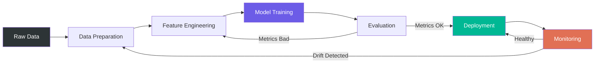

# Lesson 001: The ML Landscape: From Models to Production Operations

> **Machine learning** &nbsp;|&nbsp; Lesson 1 of 7 &nbsp;|&nbsp; August 1, 2026
> *Generated by [Wren Learning](https://github.com/vmercel/wren-learning) • advanced • practical style*

---

## Overview

Machine learning isn't magic — it's engineering with statistics at its core. This opening lesson maps the entire ML landscape from raw algorithms to production-grade systems, introducing the critical disciplines of MLOps and AIOps that separate toy notebooks from systems that run the world. By the end of this series, you'll architect ML pipelines that train, deploy, monitor, and self-heal.

## 💡 Why Most ML Projects Never Reach Production

Here's the uncomfortable truth: **87% of ML projects never make it to production** (VentureBeat, 2019 — and the number hasn't improved much). The gap isn't in the algorithms. It's in everything *around* the algorithms.

> "Everyone wants to do the model work, not the plumbing. But the plumbing IS the work." — a Staff ML Engineer at Google

This series exists to close that gap. We'll cover:

| Lesson | Topic |
|--------|-------|
| 1 | ML Landscape & Core Concepts |
| 2 | Supervised & Unsupervised Learning Deep Dive |
| 3 | Feature Engineering & Data Pipelines |
| 4 | Model Training, Tuning & Evaluation |
| 5 | MLOps — Productionizing ML |
| 6 | AIOps — AI for IT Operations |
| 7 | End-to-End Architecture & Capstone |

Today we lay the foundation: what ML actually is, how its three pillars (ML, MLOps, AIOps) relate, and why understanding the **full lifecycle** is what separates engineers from hobbyists.

## 💡 What Machine Learning Actually Is (Precisely)

Machine learning is a subset of AI where systems **learn mappings from data** rather than being explicitly programmed with rules.

Formally: given a dataset `D = {(x₁, y₁), (x₂, y₂), ..., (xₙ, yₙ)}`, ML finds a function `f(x) → ŷ` that minimizes a loss function `L(y, ŷ)` across the data.

The three paradigms:

- **Supervised Learning**: You provide labeled examples. The model learns to predict labels. *Example: classifying support tickets by severity.*
- **Unsupervised Learning**: No labels. The model discovers structure. *Example: customer segmentation from purchase history.*
- **Reinforcement Learning**: An agent learns by trial, reward, and error. *Example: optimizing cloud resource allocation in real time.*

> **Key insight**: The paradigm you choose is dictated by your **data reality**, not your preference. If you don't have labels, supervised learning is off the table — no matter how much you want it.

## 💻 Your First Model in 12 Lines

Let's make this concrete immediately. Here's a complete scikit-learn pipeline — from data to prediction:

```python
from sklearn.datasets import load_iris
from sklearn.model_selection import train_test_split
from sklearn.ensemble import RandomForestClassifier
from sklearn.metrics import accuracy_score

# Load & split
X, y = load_iris(return_X_y=True)
X_train, X_test, y_train, y_test = train_test_split(X, y, test_size=0.2, random_state=42)

# Train
model = RandomForestClassifier(n_estimators=100, random_state=42)
model.fit(X_train, y_train)

# Evaluate
preds = model.predict(X_test)
print(f"Accuracy: {accuracy_score(y_test, preds):.2%}")  # ~96.67%
```

**What's happening under the hood:**
1. `train_test_split` — prevents data leakage by holding out 20% for honest evaluation
2. `RandomForestClassifier` — builds 100 decision trees, each on a random subset of features/data, and votes
3. `accuracy_score` — simple metric: correct predictions / total predictions

> ⚠️ **Expert note**: Accuracy is a *terrible* metric for imbalanced datasets. We'll cover precision, recall, F1, and AUC-ROC in Lesson 4.

## 💡 The Three Pillars: ML vs. MLOps vs. AIOps

These three terms are constantly confused. Here's the precise distinction:

| Pillar | What It Does | Analogy |
|--------|-------------|--------|
| **ML** | Builds models that learn from data | Writing the recipe |
| **MLOps** | Operationalizes ML — CI/CD for models, monitoring, versioning, retraining | Running the restaurant kitchen |
| **AIOps** | Uses ML/AI to manage IT operations — anomaly detection, auto-remediation, capacity planning | The restaurant's automated health inspector |

**The relationship:**
- **MLOps** is about putting **your** ML models into production reliably
- **AIOps** is about using ML models to **manage production systems themselves**
- They overlap: AIOps systems are themselves ML systems that need MLOps practices

> MLOps tools: **MLflow**, **Kubeflow**, **Weights & Biases**, **Seldon Core**
> AIOps tools: **Datadog AI**, **Moogsoft**, **Dynatrace Davis**, **PagerDuty AIOps**

```bash
# Quick MLflow taste — track your experiment from the code above
pip install mlflow
```

```python
import mlflow

with mlflow.start_run():
    mlflow.log_param("n_estimators", 100)
    mlflow.log_metric("accuracy", accuracy_score(y_test, preds))
    mlflow.sklearn.log_model(model, "iris-rf")
# View at: mlflow ui → http://localhost:5000
```

That's it. You just went from "I trained a model" to "I tracked, versioned, and stored a model artifact." That single step is where MLOps begins.

## 💡 The ML Lifecycle — All 8 Stages

Every production ML system follows this lifecycle, whether you acknowledge it or not:

1. **Problem Framing** — Is ML even the right tool? (Often it's not.)
2. **Data Collection** — ETL, APIs, scraping, labeling
3. **Data Preparation** — Cleaning, imputation, encoding, splitting
4. **Feature Engineering** — Creating informative input signals
5. **Model Training** — Algorithm selection, hyperparameter tuning
6. **Evaluation** — Metrics, cross-validation, fairness audits
7. **Deployment** — Serving (batch vs. real-time), containerization
8. **Monitoring & Retraining** — Drift detection, performance decay, automated retraining

> **The dirty secret**: Steps 1-4 consume **80% of the effort**. Steps 5-6 get **80% of the attention**. Steps 7-8 determine **80% of the business value**.

This series covers all eight. Most courses stop at step 6. We won't.

## 🌟 The Factory Analogy

Think of ML as **building a factory**, not crafting a single product.

- The **raw materials** are your data
- The **assembly line** is your training pipeline
- The **quality control station** is your evaluation metrics
- The **shipping department** is your deployment infrastructure (MLOps)
- The **factory floor manager** watching gauges and fixing breakdowns? That's AIOps

A data scientist who only builds models is like an engineer who designs assembly lines but never installs them, never monitors them, and walks away when they break.

> The modern ML engineer designs the product, builds the factory, ships it, and watches the dashboards at 3 AM when drift alarms fire.

## ✍️ Exercise: Map Your Own ML Problem

Before the next lesson, complete this exercise:

1. **Identify a problem** at your company (or a personal project) where ML could help
2. Answer these five questions:
   - What **decision** would the model inform?
   - What **data** do you already have? What's missing?
   - Is this **supervised** (you have labels) or **unsupervised** (you don't)?
   - How would you **measure success**? (Not accuracy — business impact)
   - What happens when the model is **wrong**? What's the cost?

```markdown
## My ML Problem Canvas
- **Problem**: ___
- **Decision it informs**: ___
- **Available data**: ___
- **Missing data**: ___
- **Paradigm**: Supervised / Unsupervised / Reinforcement
- **Success metric**: ___
- **Cost of being wrong**: ___
```

> If you can't fill this out clearly, the model isn't the problem — **the problem statement is the problem**. This is step 1 of the lifecycle, and it's where most failures begin.

## Diagram



## Key Concepts

| Term | Definition |
|------|------------|
| **Machine Learning** | A field of AI where systems learn patterns from data to make predictions or decisions, rather than following explicitly coded rules. |
| **MLOps** | The discipline of deploying, monitoring, versioning, and maintaining ML models in production — CI/CD applied to machine learning. |
| **AIOps** | The application of ML and AI techniques to automate and enhance IT operations, including anomaly detection, root cause analysis, and auto-remediation. |
| **Supervised Learning** | ML paradigm where models learn from labeled input-output pairs to predict outputs for unseen inputs. |
| **Loss Function** | A mathematical function that quantifies the error between a model's predictions and the true values; the objective that training minimizes. |
| **Data Drift** | When the statistical properties of production input data diverge from training data, causing model performance to degrade over time. |

## Real-World Analogy

> Machine learning is like building a factory, not handcrafting a single product. Your data is the raw material, the training pipeline is the assembly line, evaluation metrics are quality control, deployment is the shipping department, and AIOps is the automated floor manager watching every gauge and sounding alarms before things break. A data scientist who only trains models is an engineer who designs assembly lines but never installs, monitors, or maintains them.

## Today's Takeaways

- [ ] ML is the algorithm, MLOps is getting it to production reliably, and AIOps is using ML to manage production systems — all three are essential
- [ ] The ML lifecycle has 8 stages; most failures happen in problem framing and data preparation, not in model selection
- [ ] Tracking experiments (even with 2 lines of MLflow code) is the single easiest step from hobbyist to professional ML practice

## Knowledge Check

**A company wants to automatically detect unusual spikes in server latency and trigger remediation runbooks without human intervention. Which discipline best describes this use case?**

- A) AIOps — applying ML to automate IT operations management
- B) MLOps — deploying and monitoring ML models in production
- C) Supervised Learning — training a model on labeled latency data
- D) Feature Engineering — creating informative signals from server logs

<details>
<summary>See Answer</summary>

**Answer: A) AIOps — applying ML to automate IT operations management**

This is AIOps: using AI/ML to detect anomalies in IT systems and auto-remediate. While MLOps practices would be used to deploy the anomaly detection model, the *use case itself* — automating IT operations with AI — is definitionally AIOps. Supervised learning and feature engineering are techniques that might be used within the solution, but they describe components, not the overall discipline.

</details>

---

*Part of the [Machine learning](https://github.com/vmercel/wren-learning/machine-learning) learning campaign &nbsp;•&nbsp; [View all lessons](https://github.com/vmercel/wren-learning)*
