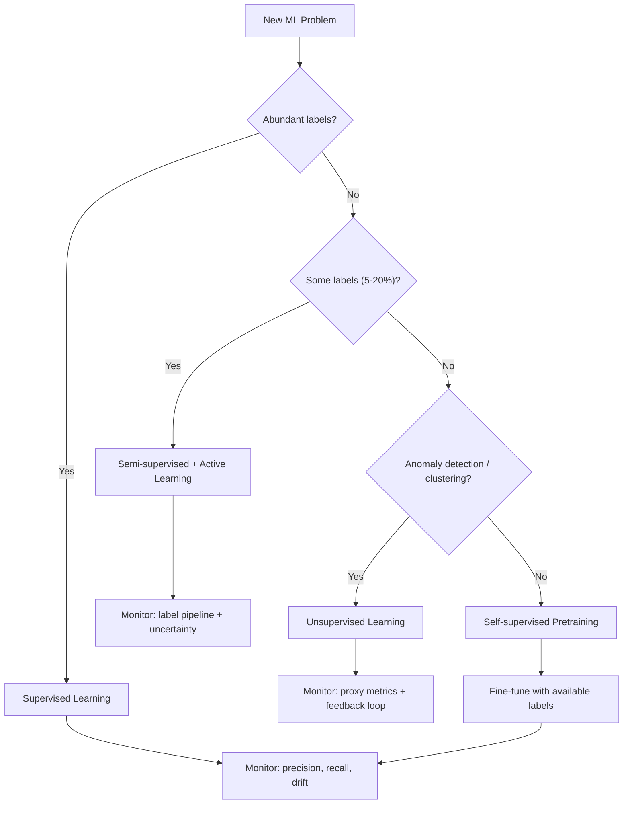

# Lesson 002: Supervised vs Unsupervised: Choosing the Right ML Paradigm

> **Machine learning** &nbsp;|&nbsp; Lesson 2 of 7 &nbsp;|&nbsp; August 1, 2026
> *Generated by [Wren Learning](https://github.com/vmercel/wren-learning) • advanced • practical style*

---

## Overview

Before you can build a pipeline or deploy a model, you must choose the right learning paradigm. This lesson dissects supervised, unsupervised, and semi-supervised learning — not just their definitions, but how each shapes your data requirements, labeling costs, monitoring strategy, and production footprint. Getting this wrong means wasted compute, misleading metrics, and models that silently degrade.

## 💡 The Three Learning Paradigms at a Glance

| Paradigm | Input | Goal | Label Requirement | Typical Use |
|---|---|---|---|---|
| **Supervised** | (X, y) pairs | Learn mapping f(X) → y | Full labels required | Classification, regression, forecasting |
| **Unsupervised** | X only | Discover structure | No labels | Clustering, anomaly detection, dimensionality reduction |
| **Semi-supervised** | Small (X, y) + large X | Leverage unlabeled mass | Partial labels | NLP with limited annotations, medical imaging |

> **Key insight:** The paradigm you choose dictates not just model architecture, but your entire **data collection pipeline**, **annotation budget**, and **monitoring strategy** in production.

## 🌟 The Restaurant Kitchen Analogy

Think of machine learning paradigms like training a new chef:

- **Supervised learning** is like giving the chef a recipe book with photos of finished dishes. For every set of ingredients (features), there's an exact picture of the expected result (label). The chef learns to replicate those outcomes. *Expensive*: someone had to cook, photograph, and annotate every dish.

- **Unsupervised learning** is like dumping a pantry of 500 unlabeled ingredients on the counter and asking the chef to "group things that go together." No one tells them what's right — they discover that citrus fruits cluster together, that spices form their own group. Useful, but the chef can't tell you *what* to cook.

- **Semi-supervised learning** is handing the chef 10 labeled recipes and 490 unlabeled ingredients, and saying "figure out the rest." The chef uses the few labeled examples to make sense of the unlabeled mass — the practical middle ground most production teams actually live in.

## 💻 Supervised Learning: The Workhorse

Supervised learning dominates production ML. Here's a concrete scikit-learn example — predicting service latency from infrastructure metrics (an AIOps scenario):

```python
import pandas as pd
from sklearn.ensemble import GradientBoostingRegressor
from sklearn.model_selection import train_test_split
from sklearn.metrics import mean_absolute_error

# Features: CPU%, memory%, request_count, pod_count
# Target: p99_latency_ms
df = pd.read_csv("infra_metrics.csv")

X = df[["cpu_pct", "mem_pct", "request_count", "pod_count"]]
y = df["p99_latency_ms"]

X_train, X_test, y_train, y_test = train_test_split(
    X, y, test_size=0.2, random_state=42
)

model = GradientBoostingRegressor(
    n_estimators=200,
    max_depth=5,
    learning_rate=0.1,
    subsample=0.8
)
model.fit(X_train, y_train)

preds = model.predict(X_test)
print(f"MAE: {mean_absolute_error(y_test, preds):.2f} ms")

# Feature importance — critical for AIOps explainability
for feat, imp in sorted(
    zip(X.columns, model.feature_importances_),
    key=lambda x: -x[1]
):
    print(f"  {feat}: {imp:.3f}")
```

**Production considerations:**
- **Label drift**: If SLO definitions change, your labels are silently invalidated
- **Label latency**: Ground truth may arrive hours/days after prediction (e.g., fraud confirmation)
- **Class imbalance**: In incident prediction, 99.5% of observations are "normal" — use stratified splits, SMOTE, or focal loss

## 💻 Unsupervised Learning: When Labels Don't Exist

Many AIOps scenarios have **no labeled incidents** to train on. Unsupervised methods shine here:

```python
from sklearn.ensemble import IsolationForest
from sklearn.preprocessing import StandardScaler
import numpy as np

# Scale features — critical for distance-based methods
scaler = StandardScaler()
X_scaled = scaler.fit_transform(df[["cpu_pct", "mem_pct", "request_count"]])

# Isolation Forest for anomaly detection
iso = IsolationForest(
    n_estimators=300,
    contamination=0.02,  # expect ~2% anomalies
    random_state=42
)
df["anomaly"] = iso.fit_predict(X_scaled)  # -1 = anomaly, 1 = normal
df["anomaly_score"] = iso.decision_function(X_scaled)

anomalies = df[df["anomaly"] == -1]
print(f"Detected {len(anomalies)} anomalous observations")
```

**When to choose unsupervised:**
- No historical incident labels exist
- You need to discover **unknown unknowns** (novel failure modes)
- Exploratory analysis before building supervised models

**The trap:** Unsupervised models are **harder to evaluate** in production. Without labels, you can't compute precision/recall. You rely on proxy metrics — alert-to-incident ratio, operator feedback loops, or downstream ticket correlation.

## 💻 Semi-Supervised & Self-Supervised: The Production Sweet Spot

Most real teams have **some** labels but not enough. Semi-supervised approaches exploit this:

**Label Propagation** — propagates known labels through a similarity graph:

```python
from sklearn.semi_supervised import LabelSpreading
import numpy as np

# -1 marks unlabeled samples
labels = y_train.copy()
mask = np.random.choice([True, False], size=len(labels), p=[0.9, 0.1])
labels[mask] = -1  # 90% unlabeled

model = LabelSpreading(kernel="knn", n_neighbors=7, alpha=0.2)
model.fit(X_train, labels)
print(f"Accuracy with 10% labels: {model.score(X_test, y_test):.3f}")
```

**Self-supervised learning** (dominant in NLP/vision) creates surrogate labels from the data itself:
- **Masked language modeling** (BERT): mask tokens, predict them
- **Contrastive learning** (SimCLR): augment images, learn that augmentations of the same image are similar

> **MLOps implication:** Semi-supervised models need **active learning loops** — the model flags uncertain predictions, humans label those, and the model retrains. This is a pipeline architecture decision, not just a modeling one.

## 💡 Decision Framework: Which Paradigm to Choose

Use this decision tree in practice:

1. **Do you have abundant, high-quality labels?**
   - ✅ → **Supervised** (start here, baseline everything)
   - ❌ → Go to 2

2. **Do you have *some* labels (5-20% of data)?**
   - ✅ → **Semi-supervised** + active learning pipeline
   - ❌ → Go to 3

3. **Is the task anomaly detection or clustering?**
   - ✅ → **Unsupervised** (Isolation Forest, DBSCAN, autoencoders)
   - ❌ → **Self-supervised pretraining** → fine-tune with whatever labels you can get

**Cost reality check:**

| Factor | Supervised | Unsupervised | Semi-supervised |
|---|---|---|---|
| Labeling cost | **$$$** | None | **$** |
| Evaluation clarity | High (precision, recall) | Low (silhouette, proxy) | Medium |
| Monitoring complexity | Moderate | **High** (no ground truth) | High (label pipeline) |
| Time to first model | Slow (labeling bottleneck) | **Fast** | Medium |

## ✍️ Exercise: Architect a Hybrid System

**Scenario:** You're building an AIOps anomaly detection system for a cloud platform processing 500M metrics/day. You have 3 months of historical data but only 47 labeled incidents.

**Your task:**

1. Sketch which paradigm you'd use for **Phase 1** (ship fast) vs **Phase 2** (improve accuracy)
2. Define the **active learning loop** — what triggers a human review?
3. What metric do you use to evaluate the unsupervised model before any labels exist?

**Suggested answer:**
- **Phase 1:** Unsupervised (Isolation Forest/autoencoder) — no label dependency, ships in days. Evaluate using alert volume stability and operator ACK rate.
- **Phase 2:** Semi-supervised — use the 47 incidents + operator feedback from Phase 1 anomalies as labels. Retrain weekly.
- **Active learning trigger:** Flag anomalies where the model's confidence score is in the 40-60% range (maximum uncertainty).
- **Proxy metric:** Ratio of flagged anomalies that operators investigate vs dismiss (precision proxy).

## Diagram



## Key Concepts

| Term | Definition |
|------|------------|
| **Supervised Learning** | Learning from labeled input-output pairs to predict outputs for unseen inputs. Requires full ground-truth labels. |
| **Unsupervised Learning** | Discovering hidden structure in unlabeled data — clustering, density estimation, anomaly detection — without target labels. |
| **Semi-supervised Learning** | Combining a small set of labeled data with a large pool of unlabeled data to improve model accuracy beyond what labels alone provide. |
| **Active Learning** | A feedback loop where the model selects its most uncertain predictions for human labeling, maximizing label efficiency. |
| **Label Drift** | When the definition or quality of labels changes over time, silently degrading model performance even if features remain stable. |
| **Contamination Rate** | In unsupervised anomaly detection, the assumed proportion of anomalies in the dataset — a critical hyperparameter that shapes alert volume. |

## Real-World Analogy

> Choosing an ML paradigm is like teaching someone to identify fish. Supervised learning gives them a field guide with every species labeled and photographed — accurate but expensive to produce. Unsupervised learning drops them at a fish market and says 'group similar ones together' — they'll find clusters but can't name the species. Semi-supervised hands them a guide with 10 species labeled and says 'figure out the other 200 using what you know.' Most marine biologists in the real world work semi-supervised — and so do most production ML teams.

## Today's Takeaways

- [ ] Your choice of learning paradigm determines not just the model, but your entire data pipeline, labeling budget, and monitoring architecture.
- [ ] Unsupervised methods ship faster (no labels needed) but are harder to evaluate — build operator feedback loops from day one.
- [ ] Semi-supervised with active learning is the practical production sweet spot: it minimizes labeling costs while continuously improving accuracy.

## Knowledge Check

**You're building an AIOps system to detect novel infrastructure failures. You have 2TB of telemetry data but only 12 historically labeled incidents. What is the most pragmatic initial approach?**

- A) Train a supervised classifier on the 12 labeled incidents
- B) Deploy an unsupervised anomaly detector and build a human feedback loop to accumulate labels
- C) Wait until you have at least 10,000 labeled incidents before building any model
- D) Use a pre-trained large language model to classify all telemetry data

<details>
<summary>See Answer</summary>

**Answer: B) Deploy an unsupervised anomaly detector and build a human feedback loop to accumulate labels**

With only 12 labels, supervised learning will massively overfit and fail to generalize. Waiting for 10K labels delays value indefinitely. An LLM isn't designed for structured telemetry classification. The pragmatic path is deploying an unsupervised detector (e.g., Isolation Forest) immediately, then using operator feedback on its alerts to build a labeled dataset for a future semi-supervised or supervised model — a classic 'ship unsupervised, evolve to supervised' pattern.

</details>

---

*Part of the [Machine learning](https://github.com/vmercel/wren-learning/machine-learning) learning campaign &nbsp;•&nbsp; [View all lessons](https://github.com/vmercel/wren-learning)*
