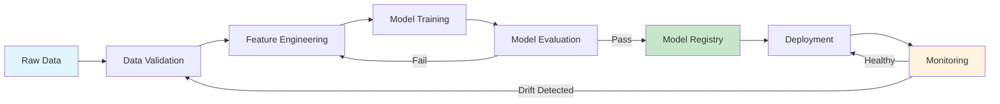

# Lesson 001: MLOps: Why Your ML Model Is Worthless Without It

> **MLOps** &nbsp;|&nbsp; Lesson 1 of 30 &nbsp;|&nbsp; August 1, 2026
> *Generated by [Wren Learning](https://github.com/vmercel/wren-learning) • advanced • practical style*

---

## Overview

87% of ML models never make it to production. MLOps is the discipline that bridges the gap between a promising notebook experiment and a reliable, scalable AI system. This opening lesson maps the entire MLOps landscape — and sets the stage for 29 lessons that will make you production-ready.

## 💡 The Production Gap: Where Models Go to Die

You've trained a model. Accuracy looks great. You high-five your team.

Then reality hits:

- **Who retrains it** when the data distribution shifts next quarter?
- **How do you rollback** when v2.3 starts returning garbage predictions at 2 AM?
- **Where are the logs** showing why the model denied a customer's loan?
- **Who notices** when inference latency spikes from 50ms to 3 seconds?

> "The last mile of ML is not modeling — it's engineering." — *Every ML team that shipped to production*

MLOps exists because **training a model is 10% of the work**. The other 90% is versioning, deploying, monitoring, retraining, governing, and scaling. This course covers all of it.

## 💡 What Exactly Is MLOps?

MLOps is a set of **practices, tools, and cultural norms** that unify ML system development (Dev) with ML system operations (Ops). It extends DevOps principles to the unique challenges of machine learning.

| Dimension | Traditional DevOps | MLOps |
|---|---|---|
| **Artifact** | Application code | Code + Data + Model |
| **Testing** | Unit/integration tests | + data validation, model validation, fairness checks |
| **Versioning** | Git for code | Git for code + DVC/LakeFS for data + Model registry |
| **CI/CD** | Build → Test → Deploy | Build → Train → Validate → Deploy → Monitor |
| **Monitoring** | Uptime, latency, errors | + data drift, concept drift, prediction quality |
| **Rollback** | Revert code commit | Revert model version + potentially retrain on clean data |

MLOps encompasses three converging disciplines:

- **MLOps Engineering** — Building the pipelines and infrastructure for ML lifecycle management
- **ML Platform Engineering** — Creating reusable, self-service platforms so data scientists ship faster
- **AIOps** — Using AI/ML itself to improve IT operations (observability, incident response, capacity planning)

## 💡 The MLOps Maturity Model

Google's MLOps maturity framework defines three levels. Knowing where you are determines what to build next.

**Level 0 — Manual Process**
- Jupyter notebooks, manual deployments, no pipeline
- Retraining is ad-hoc ("Hey, can you retrain the fraud model?")
- No monitoring beyond basic uptime

**Level 1 — ML Pipeline Automation**
- Automated training pipelines (e.g., Kubeflow, Airflow + MLflow)
- Continuous training triggered by data changes or schedules
- Feature store shared across teams
- Model registry with versioning

**Level 2 — CI/CD for ML**
- Automated testing of data, features, model quality, and infrastructure
- A/B testing and canary deployments for models
- Automated drift detection triggers retraining
- Full lineage: from raw data → feature → model → prediction → business outcome

> Most organizations are stuck at Level 0. By the end of this course, you'll know how to architect Level 2 systems.

## 📊 The MLOps Stack: A 30,000-Foot View

Here's the canonical MLOps stack you'll master across 30 lessons:

```
┌─────────────────────────────────────────────────┐
│                  SERVING LAYER                  │
│   Model APIs · A/B Testing · Edge Deployment    │
├─────────────────────────────────────────────────┤
│               MODEL REGISTRY                    │
│   MLflow · Weights & Biases · SageMaker Registry│
├─────────────────────────────────────────────────┤
│             TRAINING PIPELINES                  │
│   Kubeflow · Vertex AI · Metaflow · Airflow     │
├─────────────────────────────────────────────────┤
│              FEATURE STORE                      │
│   Feast · Tecton · Hopsworks                    │
├─────────────────────────────────────────────────┤
│            DATA VERSIONING                      │
│   DVC · LakeFS · Delta Lake                     │
├─────────────────────────────────────────────────┤
│          MONITORING & OBSERVABILITY             │
│   Evidently · Whylogs · Arize · Prometheus      │
├─────────────────────────────────────────────────┤
│         INFRASTRUCTURE & PLATFORM               │
│   Kubernetes · Terraform · Docker · Seldon      │
└─────────────────────────────────────────────────┘
```

Every layer is a lesson (or several). We'll go deep into each one.

## 💻 Your First MLOps Command: Track an Experiment

Let's make this concrete. Install MLflow and log your first tracked experiment:

```bash
pip install mlflow scikit-learn
```

```python
import mlflow
import mlflow.sklearn
from sklearn.ensemble import RandomForestClassifier
from sklearn.datasets import load_iris
from sklearn.model_selection import train_test_split
from sklearn.metrics import accuracy_score

# Load data
X, y = load_iris(return_X_y=True)
X_train, X_test, y_train, y_test = train_test_split(X, y, test_size=0.2, random_state=42)

# Start an MLflow run — THIS is where MLOps begins
with mlflow.start_run(run_name="iris-baseline-v1"):
    # Log hyperparameters
    n_estimators = 100
    max_depth = 5
    mlflow.log_param("n_estimators", n_estimators)
    mlflow.log_param("max_depth", max_depth)
    
    # Train
    model = RandomForestClassifier(n_estimators=n_estimators, max_depth=max_depth)
    model.fit(X_train, y_train)
    
    # Log metrics
    accuracy = accuracy_score(y_test, model.predict(X_test))
    mlflow.log_metric("accuracy", accuracy)
    
    # Log the model artifact
    mlflow.sklearn.log_model(model, "model")
    
    print(f"Logged run with accuracy: {accuracy:.4f}")
```

```bash
# Launch the MLflow UI to see your tracked experiment
mlflow ui --port 5000
# Open http://localhost:5000
```

This 20-line script replaces the chaos of "which notebook had the best results?" with a **versioned, searchable, reproducible** experiment record. That's the first step from Level 0 to Level 1.

## 🌟 The Factory Floor Analogy

Imagine a **car factory**.

A data scientist building a model in a notebook is like an engineer who hand-builds a single prototype car in a garage. It works. It might even win a race.

But **MLOps is the assembly line** that turns that prototype into thousands of reliable cars rolling off the floor every day:

- **Raw materials (data)** arrive on a conveyor belt, inspected for quality before they enter the line
- **Stations (pipeline stages)** each do one job: weld, paint, assemble — or in ML: validate, featurize, train, evaluate
- **Quality control (monitoring)** catches defects before cars reach customers
- **Recalls (rollbacks)** let you pull a bad batch and fix the issue
- **Blueprints (version control)** ensure every car is traceable back to its exact design

Without the factory, you have one car. With MLOps, you have a **production system**.

## 💡 Course Roadmap: What's Ahead

Here's where this 30-lesson journey takes you:

| Lessons | Theme | You'll Build |
|---|---|---|
| 1-3 | **Foundations** | Mental models, experiment tracking, reproducibility |
| 4-7 | **Data Engineering for ML** | Feature stores, data versioning, validation pipelines |
| 8-12 | **Training at Scale** | Distributed training, hyperparameter tuning, pipeline orchestration |
| 13-17 | **Model Serving & Deployment** | REST APIs, batch inference, canary deployments, edge |
| 18-22 | **Monitoring & Observability** | Drift detection, alerting, feedback loops, AIOps |
| 23-26 | **Platform Engineering** | Self-service ML platforms, Kubernetes for ML, IaC |
| 27-29 | **Governance & Security** | Model cards, lineage, compliance, adversarial robustness |
| 30 | **Capstone** | End-to-end MLOps system design |

Each lesson is hands-on. You'll leave with code, architecture patterns, and production-tested techniques.

## Diagram



## Key Concepts

| Term | Definition |
|------|------------|
| **MLOps** | A set of practices combining ML, DevOps, and data engineering to deploy and maintain ML systems in production reliably and efficiently. |
| **ML Pipeline** | An automated sequence of steps (data ingestion → validation → training → evaluation → deployment) that produces a deployable model artifact. |
| **Model Registry** | A centralized store for managing model versions, metadata, lineage, and lifecycle stages (staging, production, archived). |
| **Data Drift** | A change in the statistical distribution of input data over time, which can degrade model performance without any code change. |
| **Experiment Tracking** | Systematically recording hyperparameters, metrics, artifacts, and code versions for every training run to ensure reproducibility. |
| **AIOps** | The application of AI and ML techniques to automate and enhance IT operations — including anomaly detection, root cause analysis, and auto-remediation. |

## Real-World Analogy

> MLOps is to machine learning what a car factory assembly line is to a hand-built prototype. The prototype proves the concept; the assembly line — with its quality gates, standardized stations, traceability, and recall mechanisms — is what delivers thousands of reliable vehicles to real customers every day.

## Today's Takeaways

- [ ] Training a model is ~10% of the production ML effort; MLOps covers the other 90% — deployment, monitoring, retraining, and governance.
- [ ] The MLOps maturity model (Levels 0→2) gives you a concrete roadmap: from manual notebooks to fully automated CI/CD for ML with drift-triggered retraining.
- [ ] Start your MLOps journey today: experiment tracking with tools like MLflow is the single highest-leverage first step toward reproducible, production-grade ML.

## Knowledge Check

**What is the PRIMARY reason most ML models fail to reach production?**

- A) Lack of operational infrastructure for deployment, monitoring, and lifecycle management
- B) Insufficient model accuracy during training
- C) Shortage of GPUs for training at scale
- D) Data scientists using the wrong algorithms

<details>
<summary>See Answer</summary>

**Answer: A) Lack of operational infrastructure for deployment, monitoring, and lifecycle management**

The 'production gap' exists primarily because organizations lack the engineering infrastructure — CI/CD pipelines, monitoring, versioning, serving systems — needed to operationalize models. Model accuracy (B) is rarely the bottleneck; GPU availability (C) and algorithm choice (D) are solvable problems. The systemic challenge is operational, which is exactly what MLOps addresses.

</details>

---

*Part of the [MLOps](https://github.com/vmercel/wren-learning/mlops) learning campaign &nbsp;•&nbsp; [View all lessons](https://github.com/vmercel/wren-learning)*
